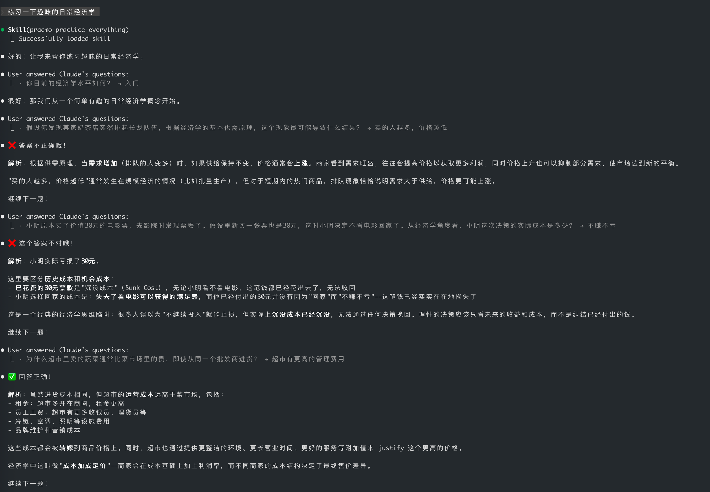

## 璞奇（Pracmo）Skills 仓库

**本仓库用于存放「璞奇（Pracmo）」 App 相关的 Skills（技能）服务配置与实现示例。**  
每一个 Skill 都是针对某类兴趣或学习场景的 AI 能力模块，可在支持的开发环境中单独使用或扩展。Skill 定义位于仓库根目录下的 **`skills/`** 目录中。

### 推荐安装方式

```bash
npx skills add https://github.com/zendong/skills
```

### 已包含的 Skills

Skill 源码与说明见对应子目录（路径均为 `skills/<skill-name>/`）。

- **`pracmo-practice-everything`**（`skills/pracmo-practice-everything/`）
  - **作用**：将任意学习目标（考试、面试、编程、语言、兴趣爱好等）转化为「提问 → 作答 → 反馈 → 继续练习」的循环。
  - **特点**：支持单选、多选、判断题以及对话式讲解，并根据用户表现自适应调整难度；交互需通过 **AskUserQuestion** 工具呈现题目与选项。
  - **说明**：详见 `skills/pracmo-practice-everything/SKILL.md`。



- **`pracmo-flow-create`**（`skills/pracmo-flow-create/`）
  - **作用**：在用户希望「把当前内容做成流炼练习」「练一下」「根据上文出题」等场景下，将对话上下文整理为流炼练习草案，并在用户确认题型与题量后，调用开放平台接口创建练习并返回分享链接。
  - **特点**：运行前需检测环境变量 **`PRACMO_APIKEY`**；若未配置，会引导用户前往 [API Key 页面](https://www.zendong.com.cn/app/api-key) 获取并配置，不会伪造已创建成功。
  - **说明**：详见 `skills/pracmo-flow-create/SKILL.md`。

### 验证环境与交互依赖

- **已完成验证的环境**：当前 Skills 已在 **ClaudeCode** 中完成验证。
- **交互依赖**：`pracmo-practice-everything` 中的练习交互依赖 **AskUserQuestion** 工具展示题目、收集作答并反馈，具体规则见 `skills/pracmo-practice-everything/SKILL.md`。`pracmo-flow-create` 侧重 API 与上下文整理，以各 Skill 内文档为准。
- **其他场景**：在其他运行环境或工具链中的行为尚未完全验证，欢迎你在不同场景中试用并通过 Issue 反馈使用体验。

### 与「璞奇」App 的关系

- **App 中并没有直接内置本仓库的 `SKILL.md` 文件**，本仓库中的 Skills 更接近于一套可复用、可阅读的「实现方案与规范示例」。
- 这些 Skills 仅覆盖了 App 中部分能力相关的 **逻辑与交互模式**，实际 App 内还包含更多产品能力（UI、数据管理、流炼、宝典等完整流程）。
- 若你希望体验更完整、更顺滑的兴趣练习与成长过程，**建议下载 App 直接使用**。

### 在「璞奇」App 中使用

如果你是普通用户，只需在 App 中使用这些能力，无需关心仓库细节：

1. 在手机上下载并安装 **「璞奇」App**：  
   - iOS: [在 App Store 下载「璞奇」（Pracmo）](https://apps.apple.com/cn/app/%E7%92%9E%E5%A5%87/id6744847459)
2. 按照 App 内指引开始练习或与 AI 互动；本仓库中的部分设计思想与交互规范在 App 中已有落地，但 App **并不**在运行时依赖本仓库文件。

> 说明：不同版本的 App 所提供的功能与体验可能有所差异，以 App 内实际展示为准。

### 在开发 / 集成场景下使用

如果你是开发者，希望在自己的环境中使用或扩展这些 Skills，可以：

- 进入对应 Skill 子目录（如 `skills/pracmo-practice-everything/`、`skills/pracmo-flow-create/`），阅读其中的 `SKILL.md`，了解交互协议、环境变量与接口约定。
- 在集成 `pracmo-practice-everything` 时，在 AI 代理或工具链中接入 **AskUserQuestion** 或等价的结构化出题能力。
- 在集成 `pracmo-flow-create` 时，正确配置 **`PRACMO_APIKEY`** 并遵守 Skill 中的接口与安全说明（勿在聊天中泄露密钥）。
- 在保持隐私与安全前提下，结合你自己的模型与数据源进行定制。

### 反馈与贡献

- **问题反馈**：如果发现 Skill 行为或文档存在问题，欢迎通过 Issue 进行反馈。
- **使用反馈**：尤其欢迎你在非 ClaudeCode 场景中的使用反馈，帮助我们改进适配性与文档说明。
- **新增 Skill**：如有适合纳入本仓库的 Skill 设计，也欢迎提交 PR 或在 Issue 中讨论。

本仓库会与「璞奇（Pracmo）」 App 及相关工具链一同演进，帮助更多用户围绕兴趣构建系统化的练习与创作能力。
