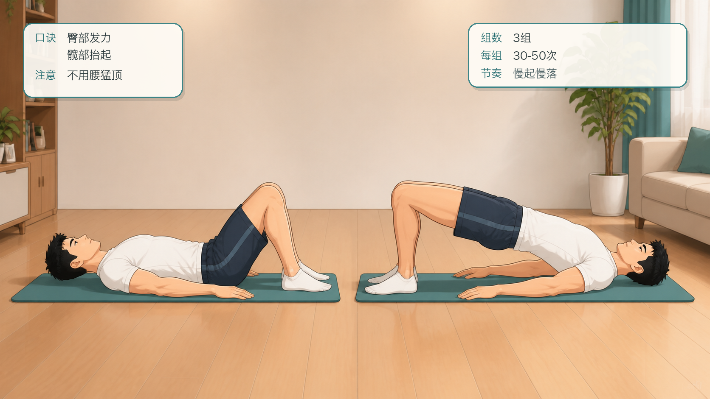
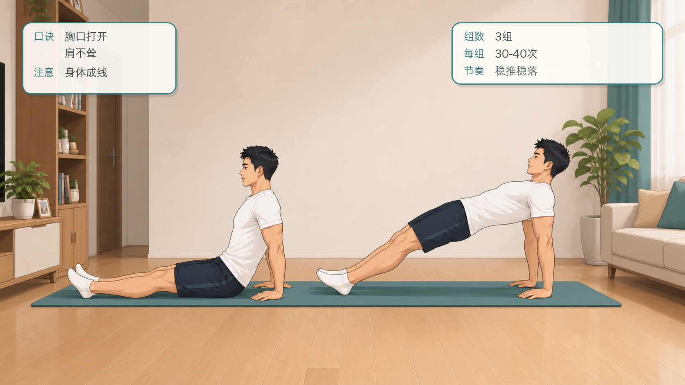
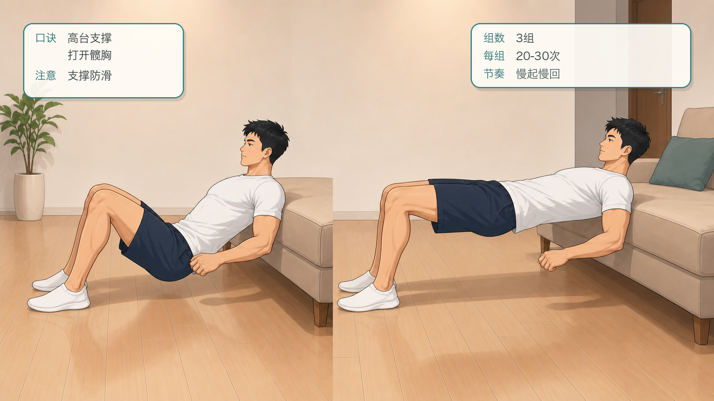
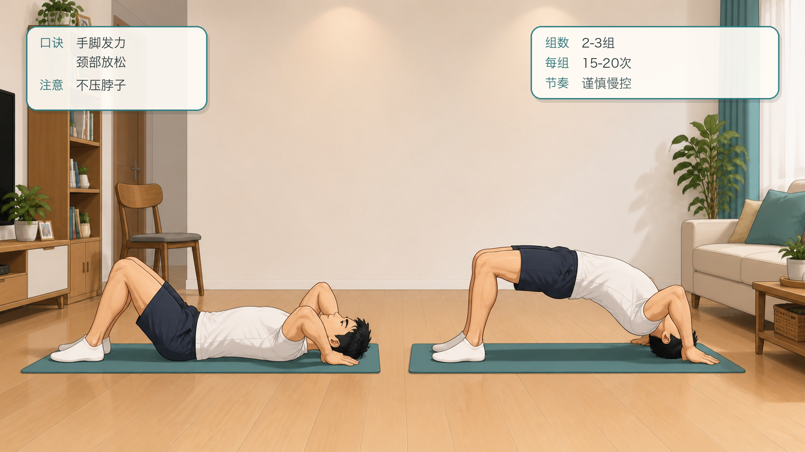
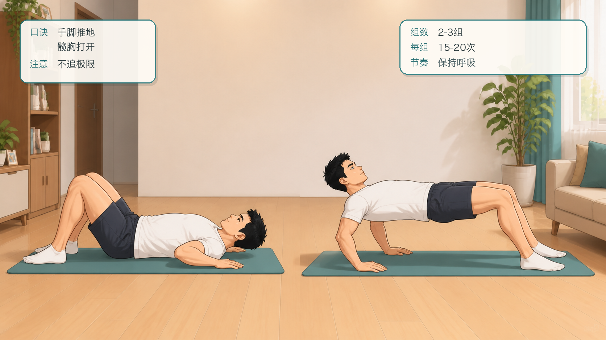
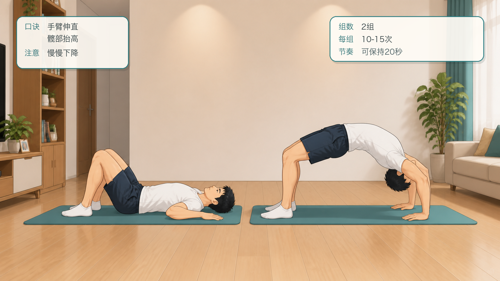
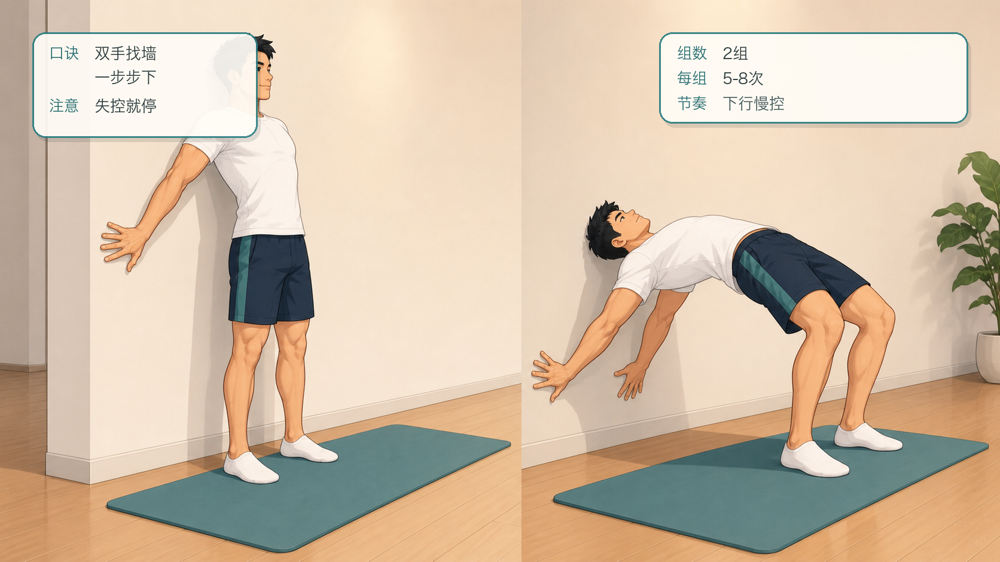
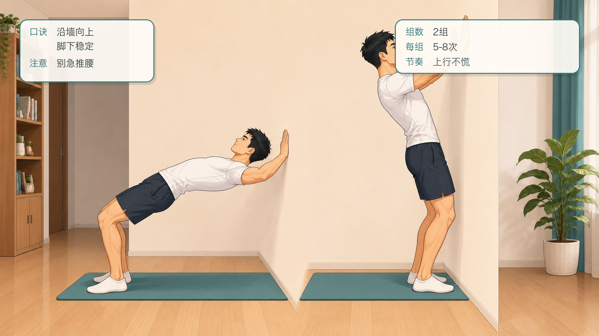
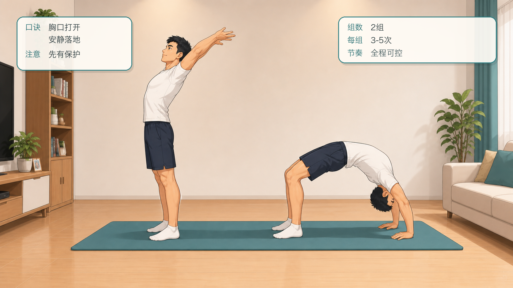
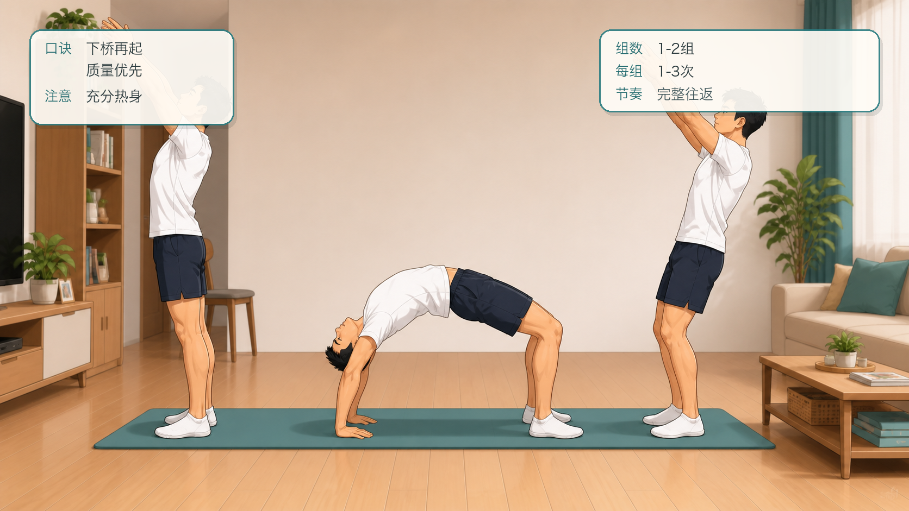

# 囚徒健身六艺：桥十式跟练计划

## 行动摘要

- 甲程：囚徒健身六艺
- 行动：桥十式跟练
- 目标：从短桥逐步过渡到站立下桥再起身，建立后链力量、脊柱伸展能力和肩髋活动度。
- 适用对象：希望安全、缓慢提高桥式能力的人。
- 安全提示：桥式对腰背、颈部和肩部要求高；如有疼痛、椎间盘问题、眩晕或康复需求，请先咨询专业医生或康复师。
- 来源说明：依据公开资料整理的 Convict Conditioning Big Six / 10-step progression 名称与顺序，跟练文案为重新编写的 App 草稿。

## 跟练计划

### 练阶 1：短桥

- levelIndex: 0
- targetSessions: 6
- estMinutes: 8
- promotionCriterion: 能完成 3 组，每组 30-50 次，腰背无不适。
- description: 用臀桥建立髋伸和后链发力。

#### 跟练内容

```text
仰卧屈膝，双脚踩地与髋同宽。收紧臀部，把髋部抬起到肩、髋、膝接近一条线，再慢慢放下。动作重点在臀腿发力，不要用腰部猛顶。
```

#### 图文资源



- caption: 短桥的起始与抬髋两个阶段；口诀：臀部发力，髋部抬起；注意：不用腰猛顶。

### 练阶 2：直桥

- levelIndex: 1
- targetSessions: 6
- estMinutes: 8
- promotionCriterion: 能完成 3 组，每组 30-40 次，肩部稳定。
- description: 增加肩部支撑和身体后侧张力。

#### 跟练内容

```text
坐姿双腿伸直，双手放在身体后方撑地。向上推起髋部，让身体从肩到脚跟接近直线，再慢慢回到坐姿。保持胸口打开，肩膀不要耸到耳边。
```

#### 图文资源



- caption: 直桥的坐姿与推起两个阶段；口诀：胸口打开，肩不耸；注意：身体成线。

### 练阶 3：高台桥

- levelIndex: 2
- targetSessions: 7
- estMinutes: 10
- promotionCriterion: 能完成 3 组，每组 20-30 次，肩胸打开可控。
- description: 通过高台降低完整桥的难度。

#### 跟练内容

```text
上背靠在稳固床沿或高台上，双脚踩地，双手准备支撑。向上打开胸腔和髋部，形成温和桥形，再慢慢回落。选择不滑动的支撑面，颈部保持舒服。
```

#### 图文资源



- caption: 高台桥的起始与打开两个阶段；口诀：高台支撑，打开髋胸；注意：支撑防滑。

### 练阶 4：头桥

- levelIndex: 3
- targetSessions: 7
- estMinutes: 10
- promotionCriterion: 能完成 2-3 组，每组 15-20 次，颈部无压力。
- description: 为完整桥准备更大的背伸范围，但必须谨慎。

#### 跟练内容

```text
仰卧屈膝，双手放在头旁。轻轻推起身体，让头顶方向接近地面或垫面，同时保持手脚发力。不要把重量压在脖子上；任何颈部不适都退回上一练阶。
```

#### 图文资源



- caption: 头桥的准备与推起两个阶段；口诀：手脚发力，颈部放松；注意：不压脖子。

### 练阶 5：半桥

- levelIndex: 4
- targetSessions: 8
- estMinutes: 12
- promotionCriterion: 能完成 2-3 组，每组 15-20 次，手脚支撑稳定。
- description: 进入接近完整桥的支撑模式。

#### 跟练内容

```text
仰卧屈膝，双手放在头旁，手脚同时发力把身体推起到半桥高度。胸口向后打开，髋部向上。保持呼吸，不追求极限高度。
```

#### 图文资源



- caption: 半桥的准备与推起两个阶段；口诀：手脚推地，髋胸打开；注意：不追极限。

### 练阶 6：标准桥

- levelIndex: 5
- targetSessions: 8
- estMinutes: 12
- promotionCriterion: 能完成 2 组，每组 10-15 次或稳定保持 20-30 秒。
- description: 完成地面完整桥，建立桥艺基础。

#### 跟练内容

```text
从仰卧屈膝开始，双手放在耳侧，手脚同时推地进入完整桥。尽量让手臂伸直、胸口打开、髋部抬高。下降时先弯手肘和膝盖，再慢慢回到地面。
```

#### 图文资源



- caption: 标准桥的准备与完整桥两个阶段；口诀：手臂伸直，髋部抬高；注意：慢慢下降。

### 练阶 7：靠墙下桥

- levelIndex: 6
- targetSessions: 9
- estMinutes: 14
- promotionCriterion: 能完成 2 组，每组 5-8 次，下行全程可控。
- description: 从站立开始，借墙训练向后下桥。

#### 跟练内容

```text
背对墙站立，双脚离墙一小步。双手向后找到墙面，沿墙一步步向下移动，直到到达可控深度或桥形。过程中保持呼吸，任何失控都立刻停在当前位置再返回。
```

#### 图文资源



- caption: 靠墙下桥的站立与下行两个阶段；口诀：双手找墙，一步步下；注意：失控就停。

### 练阶 8：靠墙起桥

- levelIndex: 7
- targetSessions: 10
- estMinutes: 15
- promotionCriterion: 能完成 2 组，每组 5-8 次，上行不慌乱。
- description: 借墙从桥形回到站立，训练反向控制。

#### 跟练内容

```text
从靠墙较低位置或桥形开始，双手沿墙一步步向上走，脚下保持稳定，直到站直。不要急着推腰，先让手、肩、髋协调发力。
```

#### 图文资源



- caption: 靠墙起桥的低位与上行两个阶段；口诀：沿墙向上，脚下稳定；注意：别急推腰。

### 练阶 9：下桥

- levelIndex: 8
- targetSessions: 10
- estMinutes: 15
- promotionCriterion: 能完成 2 组，每组 3-5 次，落地安静稳定。
- description: 不借墙从站立向后下到桥。

#### 跟练内容

```text
站立，双脚稳固，双手向上后方伸。髋部向前、胸口打开，慢慢向后找到地面。可先在软垫和伙伴保护下练习；没有控制能力时不要独自尝试。
```

#### 图文资源



- caption: 下桥的站立与桥形两个阶段；口诀：胸口打开，安静落地；注意：先有保护。

### 练阶 10：站立下桥再起身

- levelIndex: 9
- targetSessions: 12
- estMinutes: 16
- promotionCriterion: 能完成 1-2 组，每组 1-3 次完整往返，安全可控。
- description: 桥艺的主目标，要求后链力量、柔韧和空间感。

#### 跟练内容

```text
从站立进入下桥，双手落地后稳定桥形，再通过腿、臀、背和肩的协同回到站立。只在热身充分、场地安全、动作熟练时练习；质量优先于次数。
```

#### 图文资源



- caption: 站立下桥再起身的准备、桥形与回起三个阶段；口诀：下桥再起，质量优先；注意：充分热身。

## 成就节点

| levelIndex | title | description | isKey |
| --- | --- | --- | --- |
| 2 | 后链桥式入门 | 高台桥稳定，说明肩胸和髋部开始适应桥形。 | false |
| 5 | 标准桥达标 | 能完成完整桥，为靠墙下桥和起桥准备。 | true |
| 7 | 墙面控制完成 | 靠墙下桥和起桥稳定，空间感和控制力明显提高。 | false |
| 9 | 桥十式通关 | 能完成站立下桥再起身，保留最后练阶继续巩固。 | true |
