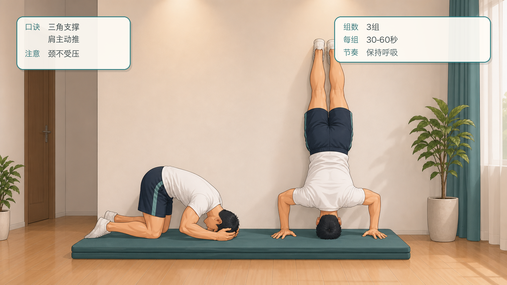
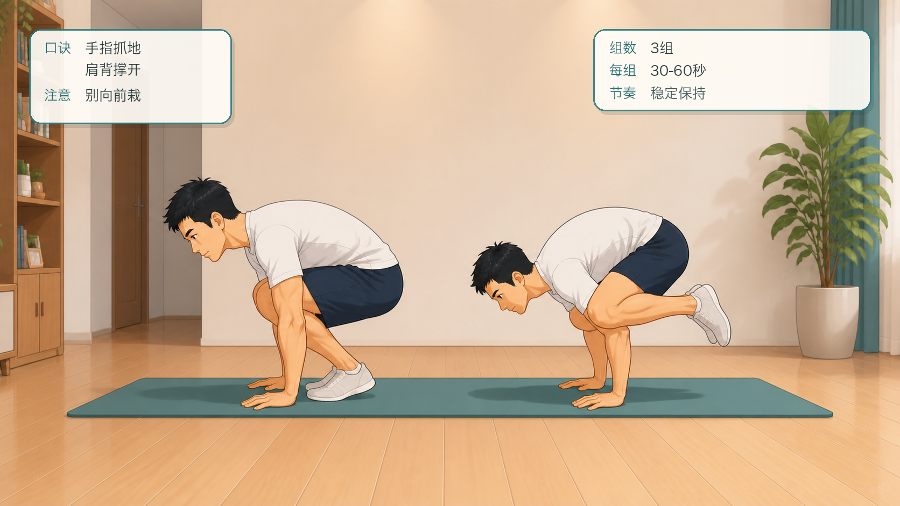
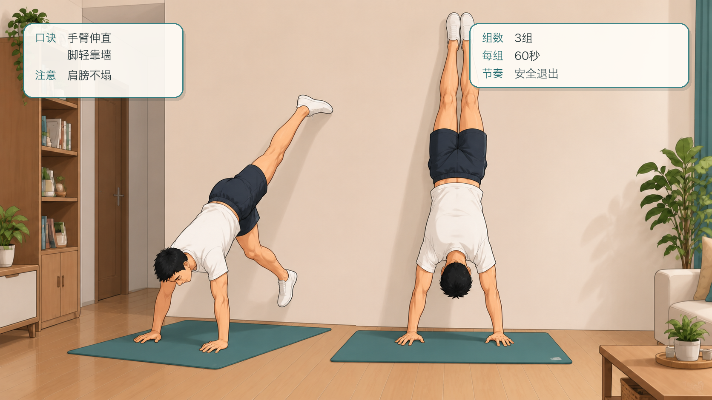
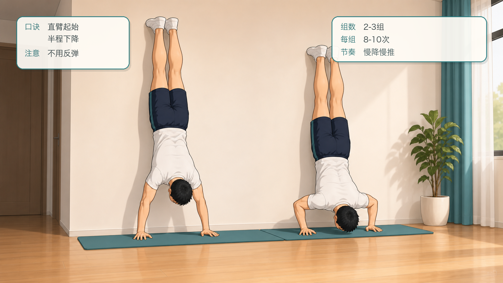
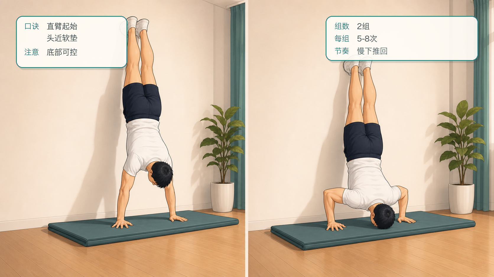
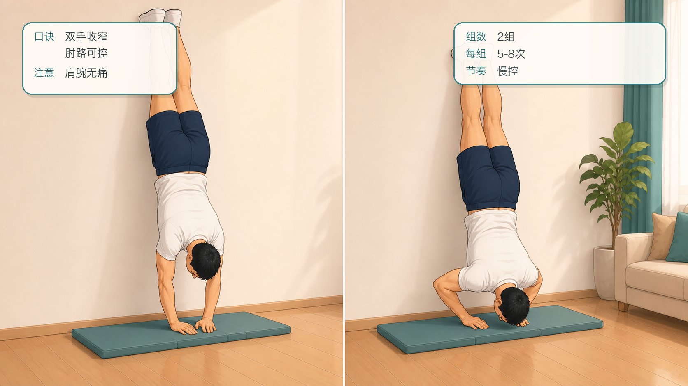
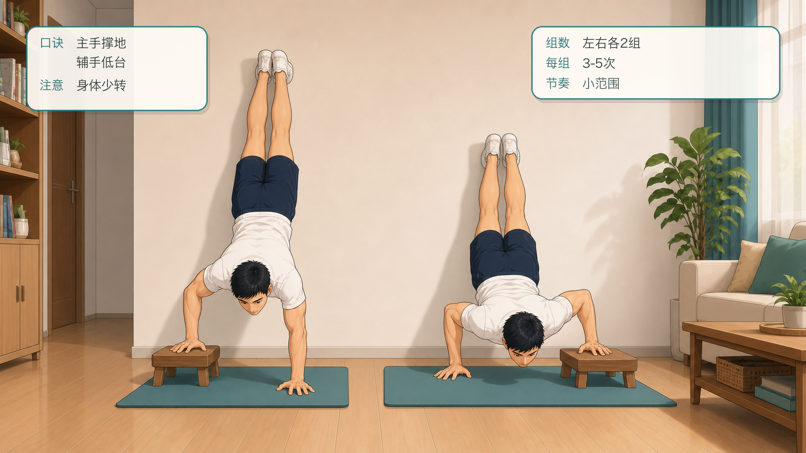
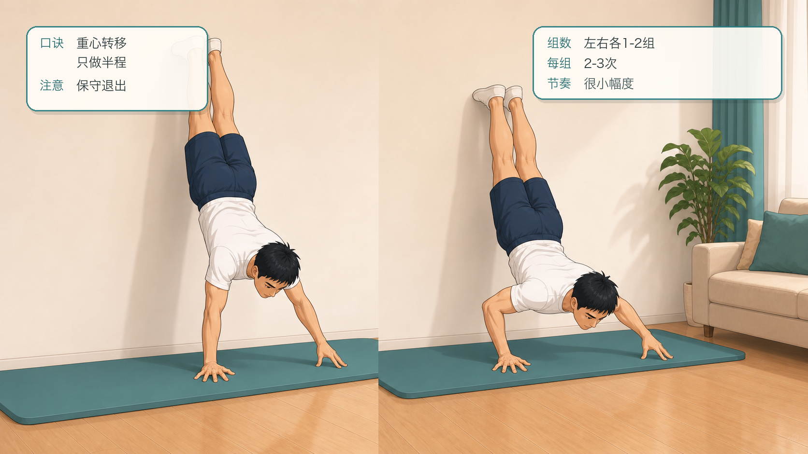
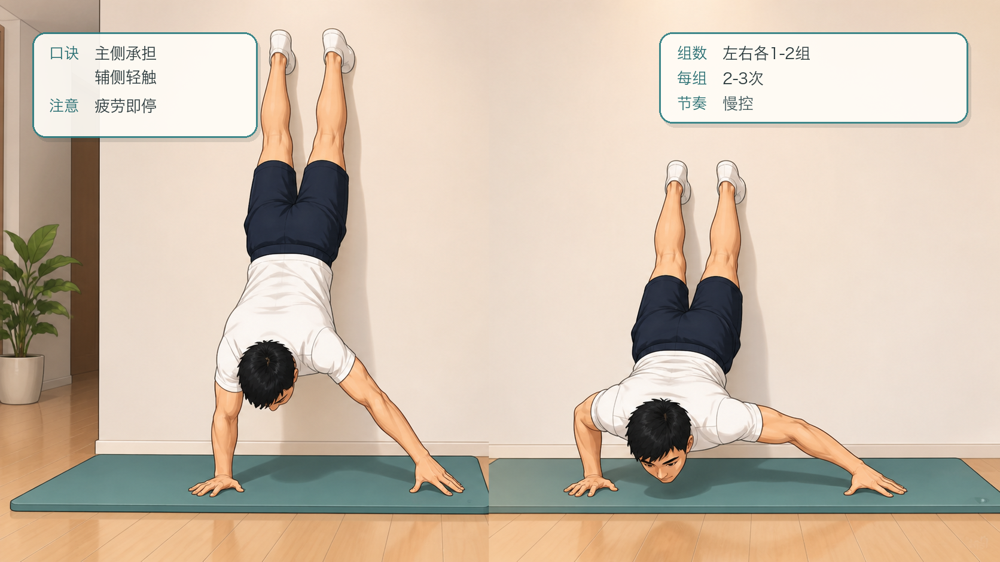
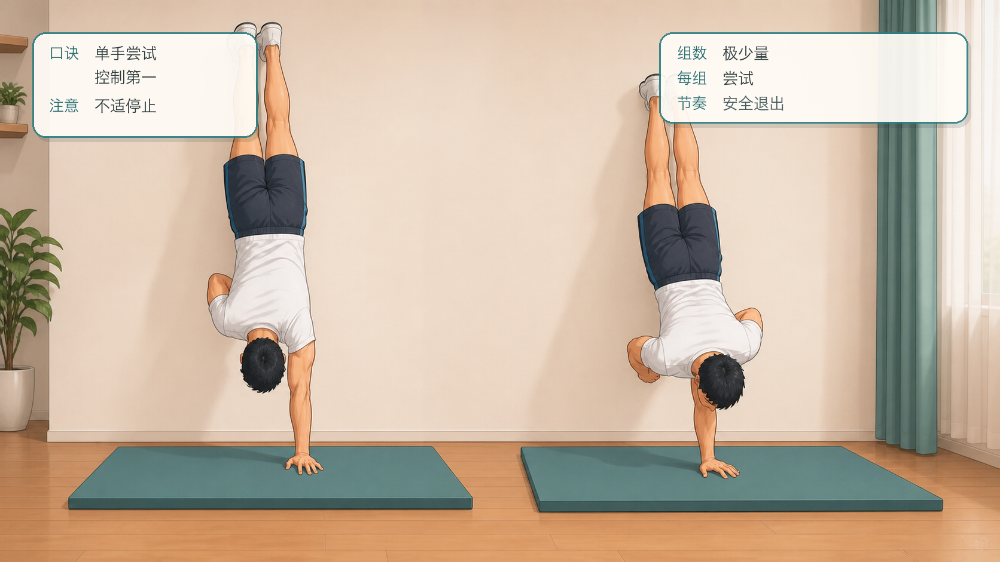

# 囚徒健身六艺：倒立撑十式跟练计划

## 行动摘要

- 甲程：囚徒健身六艺
- 行动：倒立撑十式跟练
- 目标：从靠墙头倒立逐步过渡到单臂倒立撑，建立肩部推力、倒立控制和腕肩稳定。
- 适用对象：已具备基础俯卧撑、核心控制和无痛肩腕活动的人。
- 安全提示：倒立撑对颈部、肩部、手腕和血压负担较高；如有疼痛、眩晕、高血压、眼压问题或康复需求，请先咨询专业医生或康复师。
- 来源说明：依据公开资料整理的 Convict Conditioning Big Six / 10-step progression 名称与顺序，跟练文案为重新编写的 App 草稿。

## 跟练计划

### 练阶 1：靠墙头倒立

- levelIndex: 0
- targetSessions: 6
- estMinutes: 8
- promotionCriterion: 能稳定保持 3 组，每组 30-60 秒，颈部无压力。
- description: 熟悉倒置姿势，但不把重量压到脖子上。

#### 跟练内容

```text
在软垫和墙边练习，双手与头部形成稳定三角支撑，轻轻把脚靠到墙上。保持肩膀主动发力，颈部不承受主要重量。眩晕或颈部不适时立即退出。
```

#### 图文资源



- caption: 靠墙头倒立的准备与稳定两个阶段；口诀：三角支撑，肩主动推；注意：颈不受压。

### 练阶 2：乌鸦式

- levelIndex: 1
- targetSessions: 6
- estMinutes: 8
- promotionCriterion: 能稳定保持 3 组，每组 30-60 秒。
- description: 建立手腕承重、肩胛前推和身体平衡。

#### 跟练内容

```text
双手撑地，膝盖靠近上臂，身体重心慢慢向前。脚尖轻离地后保持平衡，眼睛看前下方。手指抓地，肩背主动撑开，不要突然向前栽倒。
```

#### 图文资源



- caption: 乌鸦式的准备与平衡两个阶段；口诀：手指抓地，肩背撑开；注意：别向前栽。

### 练阶 3：靠墙倒立

- levelIndex: 2
- targetSessions: 7
- estMinutes: 10
- promotionCriterion: 能稳定保持 3 组，每组 60 秒，肩膀不塌。
- description: 建立完整倒立支撑能力。

#### 跟练内容

```text
面对墙或背对墙进入倒立，双手扎稳，脚轻靠墙。手臂伸直但不锁死，肩膀向上推，肋骨回收。保持呼吸，退出时一脚一脚安全落地。
```

#### 图文资源



- caption: 靠墙倒立的进入与稳定两个阶段；口诀：手臂伸直，脚轻靠墙；注意：肩膀不塌。

### 练阶 4：半程倒立撑

- levelIndex: 3
- targetSessions: 7
- estMinutes: 12
- promotionCriterion: 能完成 2-3 组，每组 8-10 次，下降深度一致。
- description: 在靠墙倒立中训练半程推力。

#### 跟练内容

```text
靠墙倒立后，缓慢弯曲手肘下降到半程，再推回伸直。头部不要撞地，肩膀保持主动。每次都控制下降，不能用反弹。
```

#### 图文资源



- caption: 半程倒立撑的起始与下降两个阶段；口诀：直臂起始，半程下降；注意：不用反弹。

### 练阶 5：标准倒立撑

- levelIndex: 4
- targetSessions: 8
- estMinutes: 12
- promotionCriterion: 能完成 2 组，每组 5-8 次，底部可控。
- description: 完成靠墙完整倒立撑。

#### 跟练内容

```text
靠墙倒立，弯肘下降到头部接近软垫或可控深度，再推回顶端。保持身体紧张，不塌腰。若底部失控，退回半程倒立撑。
```

#### 图文资源



- caption: 标准倒立撑的起始与底部两个阶段；口诀：直臂起始，头近软垫；注意：底部可控。

### 练阶 6：窄距倒立撑

- levelIndex: 5
- targetSessions: 8
- estMinutes: 12
- promotionCriterion: 能完成 2 组，每组 5-8 次，手腕和肩无不适。
- description: 缩小手距，提高肩臂推力要求。

#### 跟练内容

```text
靠墙倒立，双手距离比标准倒立撑更窄。慢慢下降并推起，保持肘部轨迹可控。若肩部夹挤或手腕疼痛，立即放宽手距或退阶。
```

#### 图文资源



- caption: 窄距倒立撑的起始与底部两个阶段；口诀：双手收窄，肘路可控；注意：肩腕无痛。

### 练阶 7：偏重倒立撑

- levelIndex: 6
- targetSessions: 9
- estMinutes: 14
- promotionCriterion: 左右两侧都能完成 2 组，每组 3-5 次。
- description: 一手主力，一手放在低支撑物上辅助。

#### 跟练内容

```text
靠墙倒立，一手撑地为主力，另一手撑在稳固低支撑物上。下降和推起时保持身体尽量不旋转。左右交替练习，宁可小范围高质量完成。
```

#### 图文资源



- caption: 偏重倒立撑的起始与下降两个阶段；口诀：主手撑地，辅手低台；注意：身体少转。

### 练阶 8：半程单臂倒立撑

- levelIndex: 7
- targetSessions: 10
- estMinutes: 15
- promotionCriterion: 左右两侧都能完成 1-2 组，每组 2-3 次可控半程。
- description: 单臂倒立撑路线的高难准备。

#### 跟练内容

```text
只在倒立稳定、肩腕完全无痛时尝试。靠墙倒立后逐渐把一侧重量转到主力手，另一手减少发力或轻触辅助。只做很小半程，保持安全退出能力。
```

#### 图文资源



- caption: 半程单臂倒立撑的起始与小幅下降两个阶段；口诀：重心转移，只做半程；注意：保守退出。

### 练阶 9：杠杆倒立撑

- levelIndex: 8
- targetSessions: 10
- estMinutes: 15
- promotionCriterion: 左右两侧都能完成 1-2 组，每组 2-3 次，辅助侧不抢力。
- description: 辅助手臂伸远，只提供平衡，主力侧承担主要推力。

#### 跟练内容

```text
靠墙倒立，一手为主力，另一手向侧方伸远轻触地面或低支撑。缓慢下降和推起，辅助侧只防止旋转。保持高度保守，疲劳时不要继续。
```

#### 图文资源



- caption: 杠杆倒立撑的起始与下降两个阶段；口诀：主侧承担，辅侧轻触；注意：疲劳即停。

### 练阶 10：单臂倒立撑

- levelIndex: 9
- targetSessions: 12
- estMinutes: 16
- promotionCriterion: 能完成极少量高质量尝试，并保持安全退出；不以数量为唯一目标。
- description: 倒立撑艺的极高阶目标，风险和门槛都很高。

#### 跟练内容

```text
仅适合长期训练者在安全环境中尝试。靠墙倒立后逐步转移重量到单手，保持肩膀主动上推和全身紧张。动作以控制和退出能力为第一标准，任何不适都停止。
```

#### 图文资源



- caption: 单臂倒立撑的起始与小幅尝试两个阶段；口诀：单手尝试，控制第一；注意：不适停止。

## 成就节点

| levelIndex | title | description | isKey |
| --- | --- | --- | --- |
| 2 | 倒立支撑稳定 | 靠墙倒立能稳定保持，具备进入倒立撑训练的基础。 | false |
| 4 | 标准倒立撑达标 | 能完成可控倒立撑，为窄距和偏重训练打基础。 | true |
| 6 | 单侧推力准备 | 偏重倒立撑左右平衡，进入高阶单臂路线准备。 | false |
| 9 | 倒立撑十式通关 | 能安全尝试单臂倒立撑路线，保留最后练阶继续巩固。 | true |
