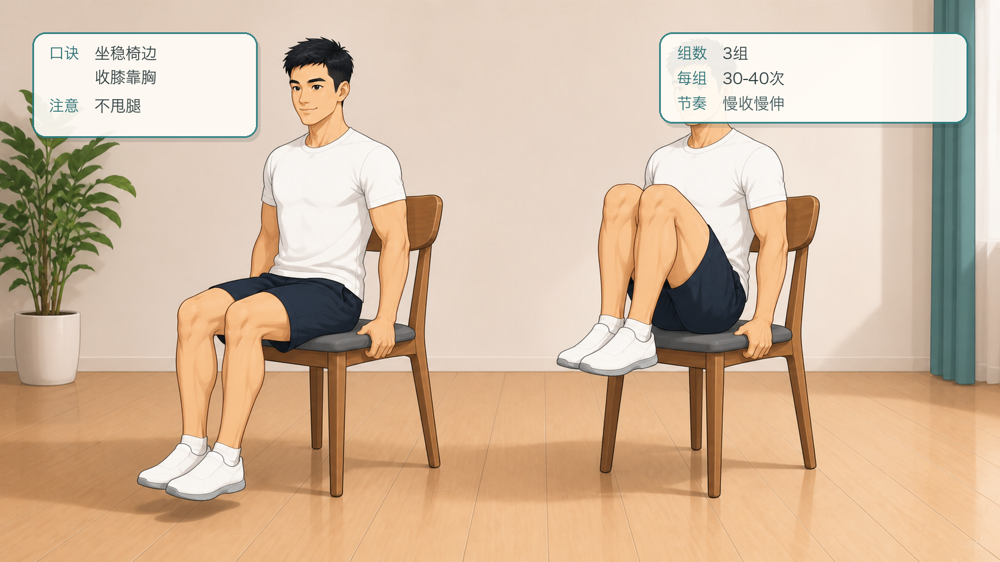
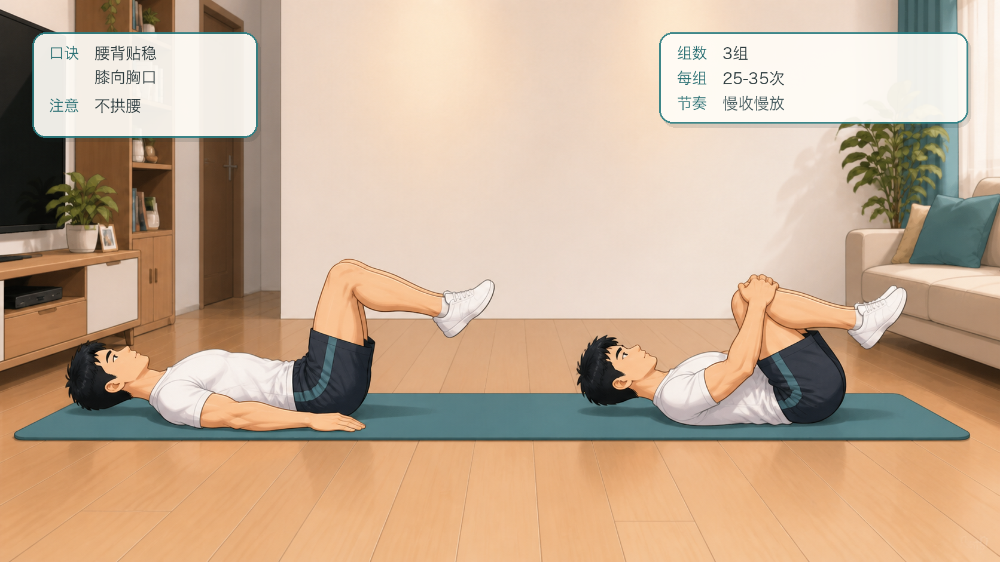
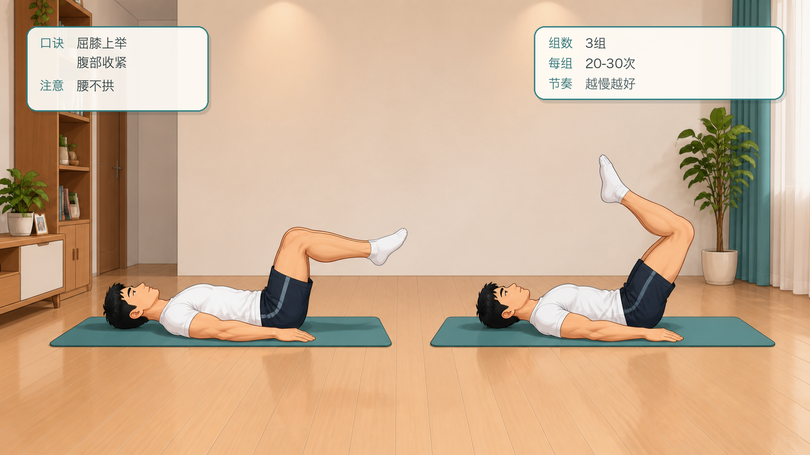
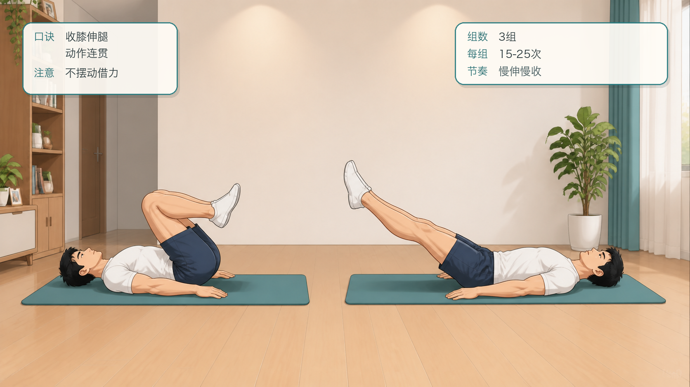
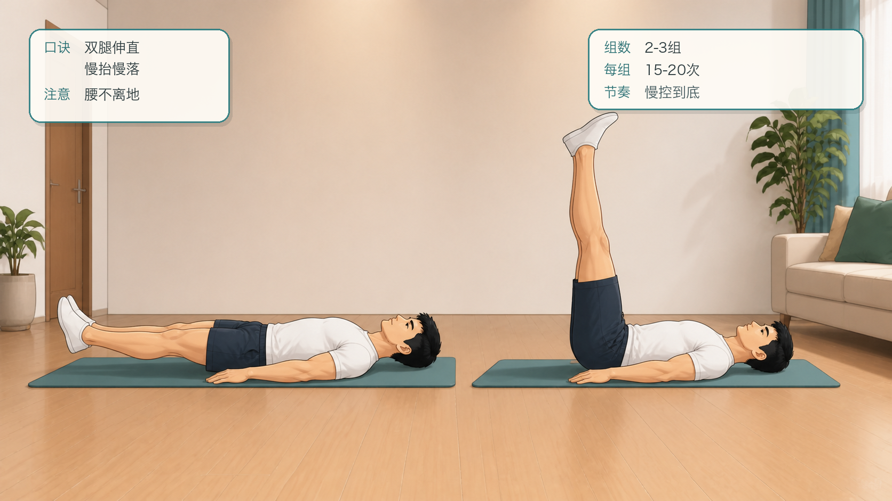
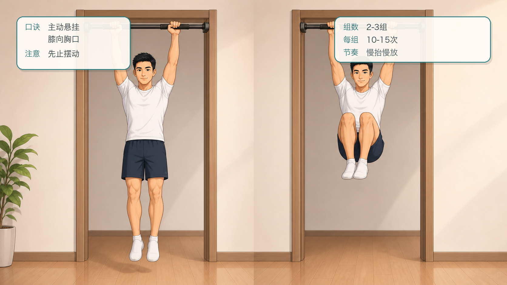
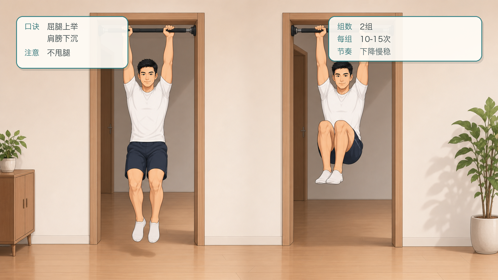
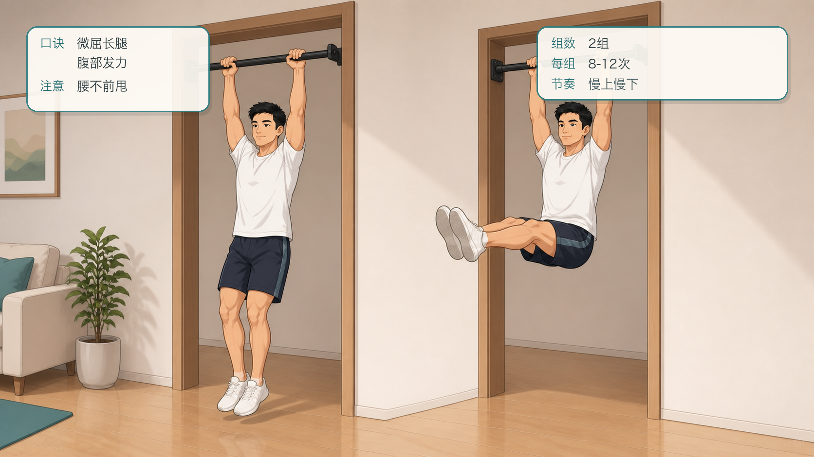
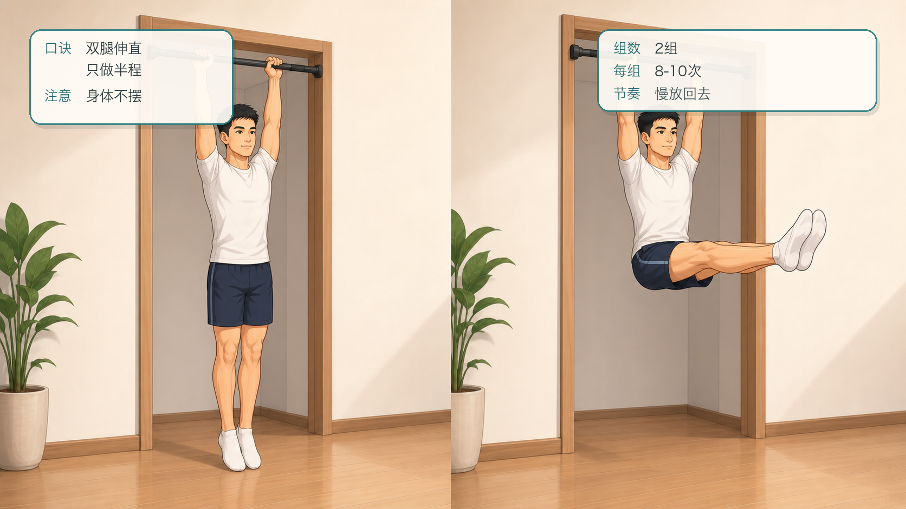
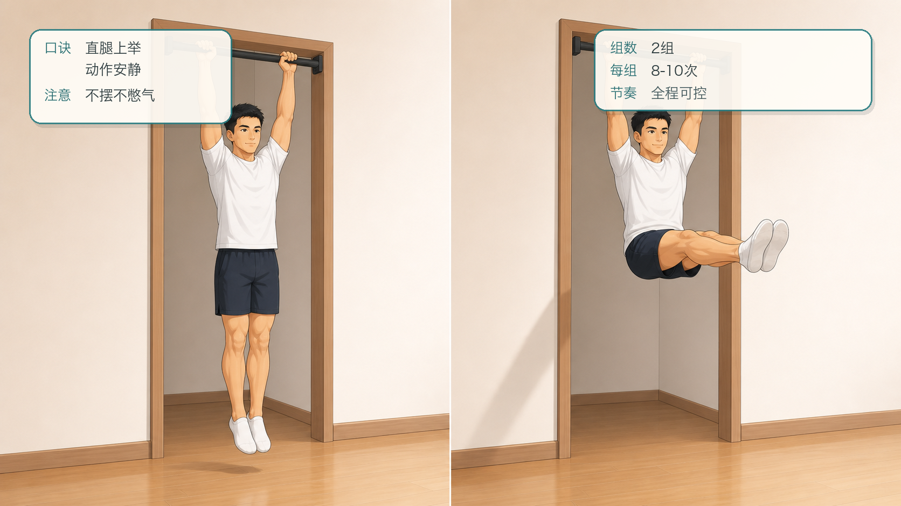

# 囚徒健身六艺：举腿十式跟练计划

## 行动摘要

- 甲程：囚徒健身六艺
- 行动：举腿十式跟练
- 目标：从收膝逐步过渡到悬垂直腿举，建立腹部力量、髋屈控制和骨盆稳定。
- 适用对象：希望循序渐进训练核心控制的人。
- 安全提示：如有腰背、髋部疼痛或康复需求，请先咨询专业医生或康复师；腰部代偿明显时降低难度。
- 来源说明：依据公开资料整理的 Convict Conditioning Big Six / 10-step progression 名称与顺序，跟练文案为重新编写的 App 草稿。

## 跟练计划

### 练阶 1：坐姿收膝

- levelIndex: 0
- targetSessions: 6
- estMinutes: 8
- promotionCriterion: 能完成 3 组，每组 30-40 次，腰背不疼。
- description: 用坐姿学习骨盆和膝盖向身体靠近。

#### 跟练内容

```text
坐在椅边或地面，双手轻扶身体两侧。双膝弯曲，慢慢把膝盖向胸口收，再伸回去但不完全放松。保持背部稳定，不用惯性甩腿。
```

#### 图文资源



- caption: 坐姿收膝的起始与收膝两个阶段；口诀：坐稳椅边，收膝靠胸；注意：不甩腿。

### 练阶 2：仰卧收膝

- levelIndex: 1
- targetSessions: 6
- estMinutes: 8
- promotionCriterion: 能完成 3 组，每组 25-35 次，腰部贴地可控。
- description: 在仰卧位训练下腹和骨盆后倾。

#### 跟练内容

```text
仰卧，双膝弯曲，双脚离地。收紧腹部，把膝盖向胸口带，再慢慢伸回起点。下背尽量保持稳定，不让腰部明显拱起。
```

#### 图文资源



- caption: 仰卧收膝的起始与收膝两个阶段；口诀：腰背贴稳，膝向胸口；注意：不拱腰。

### 练阶 3：仰卧屈腿举

- levelIndex: 2
- targetSessions: 7
- estMinutes: 10
- promotionCriterion: 能完成 3 组，每组 20-30 次，腿部伸展时腰不拱。
- description: 增加腿部杠杆，仍保持膝盖弯曲。

#### 跟练内容

```text
仰卧，双腿弯曲抬起。缓慢把双腿向前下方伸出，再收回到身体上方。动作越慢越好，重点是保持腹部收紧和下背稳定。
```

#### 图文资源



- caption: 仰卧屈腿举的起始与上举两个阶段；口诀：屈膝上举，腹部收紧；注意：腰不拱。

### 练阶 4：仰卧蛙式举腿

- levelIndex: 3
- targetSessions: 7
- estMinutes: 10
- promotionCriterion: 能完成 3 组，每组 15-25 次。
- description: 从屈腿过渡到更长杠杆的半伸腿动作。

#### 跟练内容

```text
仰卧后抬起双腿，膝盖保持适度弯曲。下降时双腿逐渐向前伸，回收时膝盖再靠近身体。保持动作连贯，不用摆动借力。
```

#### 图文资源



- caption: 仰卧蛙式举腿的收膝与伸腿两个阶段；口诀：收膝伸腿，动作连贯；注意：不摆动借力。

### 练阶 5：仰卧直腿举

- levelIndex: 4
- targetSessions: 8
- estMinutes: 12
- promotionCriterion: 能完成 2-3 组，每组 15-20 次，下背稳定。
- description: 在地面完成完整直腿举。

#### 跟练内容

```text
仰卧，双腿并拢伸直。慢慢抬腿到接近垂直，再缓慢下降到接近地面但不放松。下背离地或髋部不适时，先缩小范围或退回上一练阶。
```

#### 图文资源



- caption: 仰卧直腿举的起始与上举两个阶段；口诀：双腿伸直，慢抬慢落；注意：腰不离地。

### 练阶 6：悬垂收膝

- levelIndex: 5
- targetSessions: 8
- estMinutes: 12
- promotionCriterion: 能完成 2-3 组，每组 10-15 次，身体不摆动。
- description: 进入悬垂核心训练，同时建立握力和肩部稳定。

#### 跟练内容

```text
双手抓牢横杠，身体主动悬挂。收紧腹部，把膝盖向胸口抬起，再慢慢放下。每次都先止住身体摆动，再开始下一次。
```

#### 图文资源



- caption: 悬垂收膝的起始与收膝两个阶段；口诀：主动悬挂，膝向胸口；注意：先止摆动。

### 练阶 7：悬垂屈腿举

- levelIndex: 6
- targetSessions: 9
- estMinutes: 14
- promotionCriterion: 能完成 2 组，每组 10-15 次，下降慢而稳。
- description: 在悬垂中增加腿部杠杆。

#### 跟练内容

```text
悬挂后双膝弯曲，抬腿到大腿接近水平或更高，再慢慢下降。保持肩膀下沉，不要用甩腿制造高度。
```

#### 图文资源



- caption: 悬垂屈腿举的起始与上举两个阶段；口诀：屈腿上举，肩膀下沉；注意：不甩腿。

### 练阶 8：悬垂蛙式举腿

- levelIndex: 7
- targetSessions: 10
- estMinutes: 15
- promotionCriterion: 能完成 2 组，每组 8-12 次，躯干稳定。
- description: 从屈腿过渡到接近直腿的悬垂举腿。

#### 跟练内容

```text
悬挂后抬起双腿，膝盖保持轻微弯曲。上抬时尽量让大腿接近身体，下降时慢慢伸长腿部。保持腹部主动发力，避免腰部前甩。
```

#### 图文资源



- caption: 悬垂蛙式举腿的起始与上举两个阶段；口诀：微屈长腿，腹部发力；注意：腰不前甩。

### 练阶 9：部分悬垂直腿举

- levelIndex: 8
- targetSessions: 10
- estMinutes: 15
- promotionCriterion: 能完成 2 组，每组 8-10 次，腿部保持伸直。
- description: 直腿悬垂动作的半程准备。

#### 跟练内容

```text
悬挂后双腿并拢伸直。缓慢抬到半程或大腿接近水平，再慢放回去。只做能保持腿直和身体不摆动的范围。
```

#### 图文资源



- caption: 部分悬垂直腿举的起始与半程两个阶段；口诀：双腿伸直，只做半程；注意：身体不摆。

### 练阶 10：悬垂直腿举

- levelIndex: 9
- targetSessions: 12
- estMinutes: 16
- promotionCriterion: 能完成 2 组，每组 8-10 次，完整范围可控。
- description: 举腿艺的主目标，考验核心力量、髋屈能力和悬垂稳定。

#### 跟练内容

```text
双手抓杠主动悬挂，双腿并拢伸直。收紧腹部，把双腿抬到水平或更高，再慢慢下降。保持动作安静、可控，不用摆动或憋气硬顶。
```

#### 图文资源



- caption: 悬垂直腿举的起始与上举两个阶段；口诀：直腿上举，动作安静；注意：不摆不憋气。

## 成就节点

| levelIndex | title | description | isKey |
| --- | --- | --- | --- |
| 2 | 地面核心入门 | 仰卧屈腿举稳定，说明骨盆控制开始建立。 | false |
| 4 | 地面直腿举达标 | 能完成仰卧直腿举，为悬垂路线打基础。 | true |
| 6 | 悬垂核心稳定 | 悬垂屈腿举稳定，握力和肩部控制可承接下一阶段。 | false |
| 9 | 举腿十式通关 | 能完成悬垂直腿举，保留最后练阶继续巩固。 | true |
