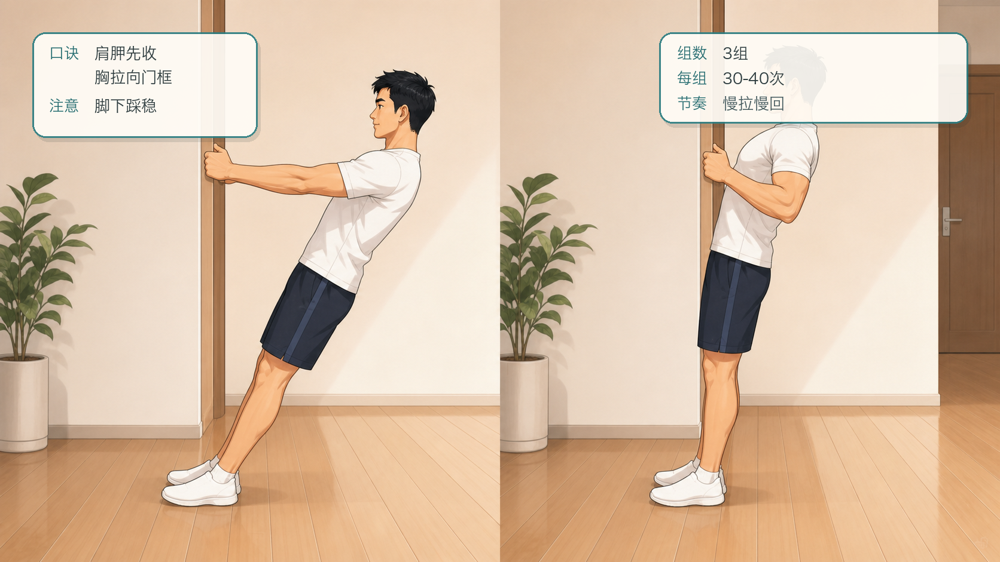
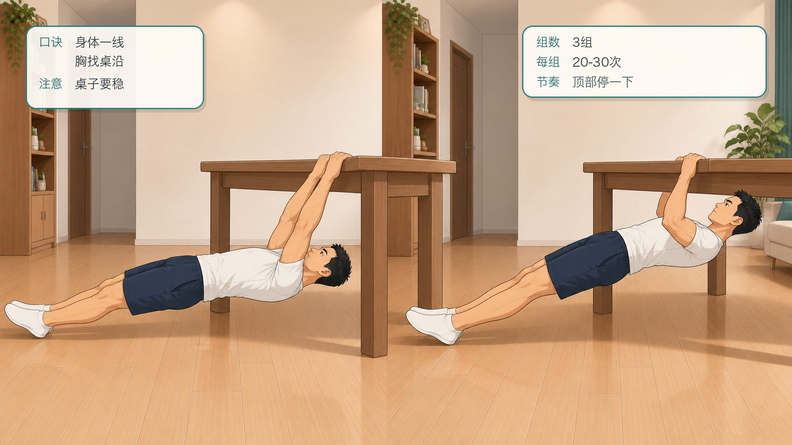
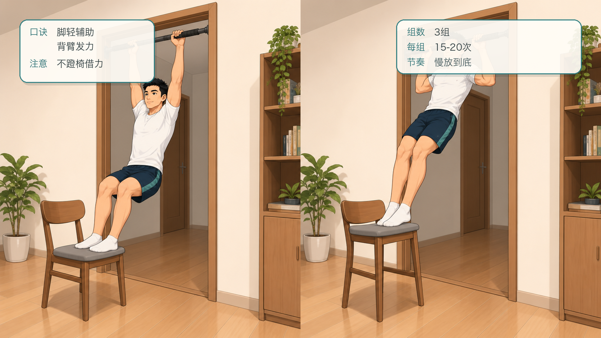
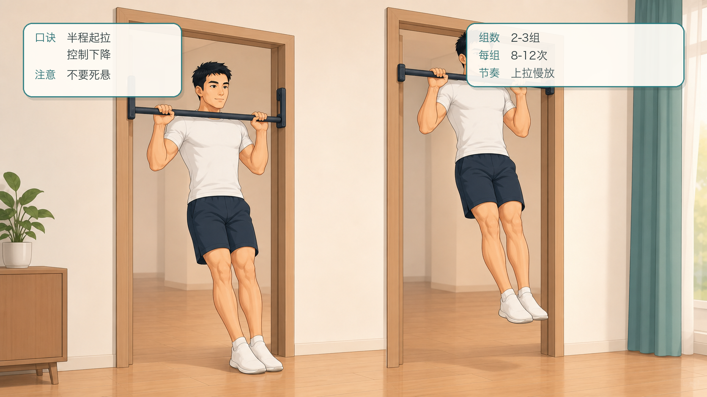
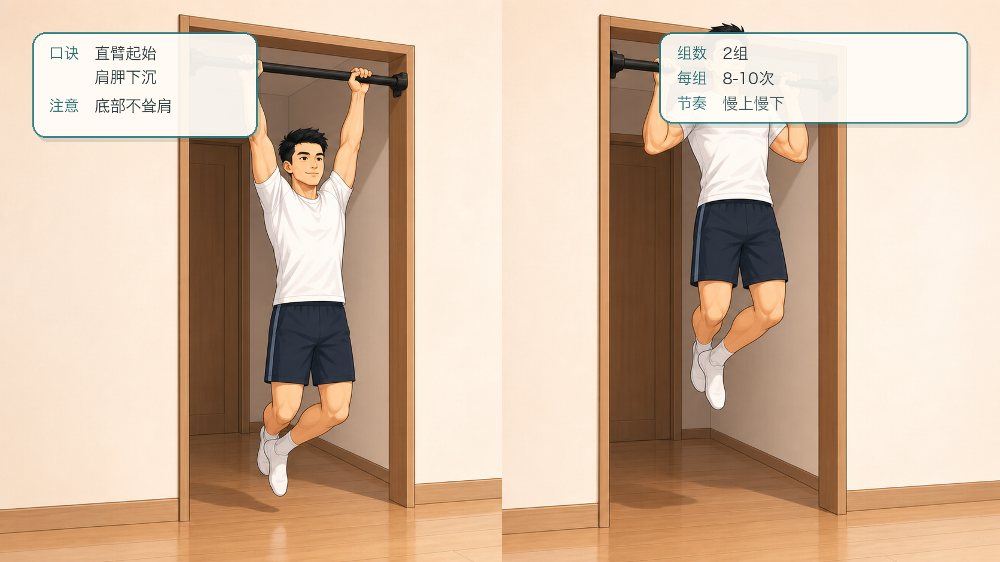
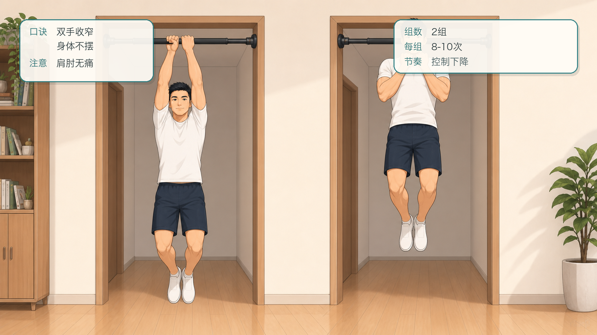
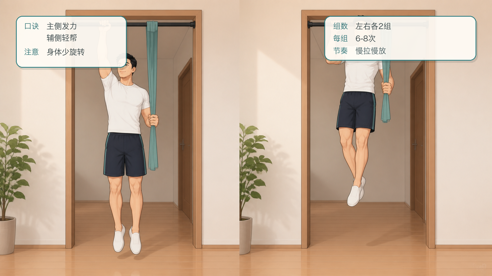
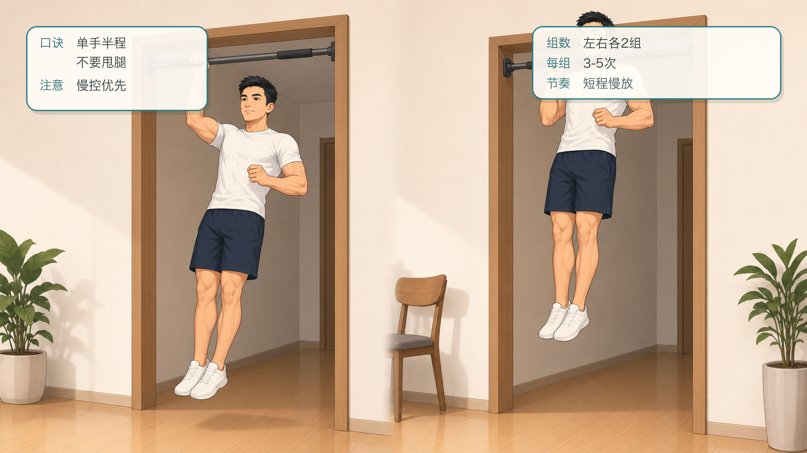
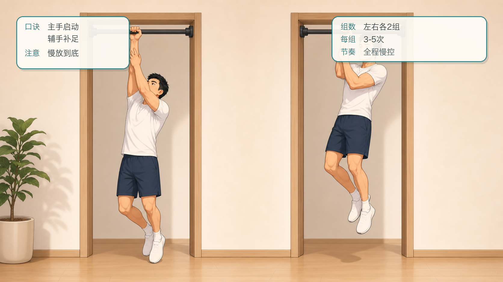
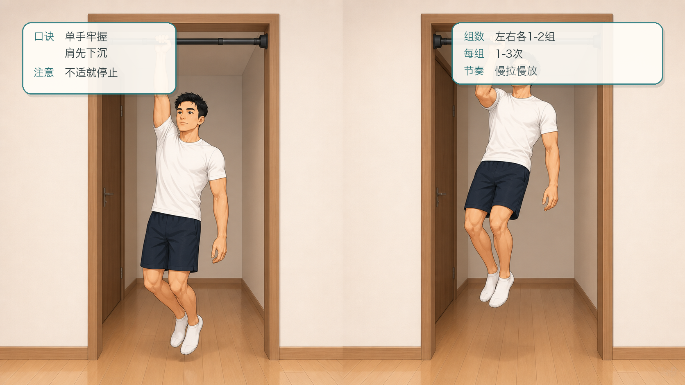

# 囚徒健身六艺：引体十式跟练计划

## 行动摘要

- 甲程：囚徒健身六艺
- 行动：引体十式跟练
- 目标：从垂直拉逐步过渡到单臂引体，建立背部拉力、握力和肩胛控制。
- 适用对象：希望循序渐进训练自重拉力的人。
- 安全提示：如有肩、肘、腕疼痛或康复需求，请先咨询专业医生或康复师；悬挂训练必须使用牢固器械。
- 来源说明：依据公开资料整理的 Convict Conditioning Big Six / 10-step progression 名称与顺序，跟练文案为重新编写的 App 草稿。

## 跟练计划

### 练阶 1：垂直拉

- levelIndex: 0
- targetSessions: 6
- estMinutes: 8
- promotionCriterion: 能完成 3 组，每组 30-40 次，肩胛能主动后收。
- description: 用站姿低负荷学习拉的轨迹。

#### 跟练内容

```text
面对门框、栏杆或稳固立柱站立，双手抓住支撑物，身体微微后倾。先让肩胛后收，再弯曲手肘把胸口拉向支撑物，随后慢慢回到起点。全程保持脚下稳定。
```

#### 图文资源



- caption: 垂直拉的起始与拉近两个阶段；口诀：肩胛先收，胸拉向门框；注意：脚下踩稳。

### 练阶 2：水平拉

- levelIndex: 1
- targetSessions: 6
- estMinutes: 10
- promotionCriterion: 能完成 3 组，每组 20-30 次，身体保持直线。
- description: 进入倒划船模式，增加背部和手臂负荷。

#### 跟练内容

```text
抓住低杠、桌沿或吊环，身体斜躺成直线，脚踩地。先收紧肩胛，再把胸口拉向支撑点，顶部停顿后慢放回去。选择不会翻倒的支撑物。
```

#### 图文资源



- caption: 水平拉的起始与拉近两个阶段；口诀：身体一线，胸找桌沿；注意：桌子要稳。

### 练阶 3：折刀引体

- levelIndex: 2
- targetSessions: 7
- estMinutes: 10
- promotionCriterion: 能完成 3 组，每组 15-20 次，腿部辅助可控。
- description: 在高杠上练习引体路径，用脚分担部分重量。

#### 跟练内容

```text
双手抓杠，双脚放在前方椅子或地面上辅助。向上拉到下巴接近杠，再慢慢下降。脚只提供必要帮助，优先让背部和手臂完成动作。
```

#### 图文资源



- caption: 折刀引体的起始与上拉两个阶段；口诀：脚轻辅助，背臂发力；注意：不蹬椅借力。

### 练阶 4：半程引体

- levelIndex: 3
- targetSessions: 7
- estMinutes: 12
- promotionCriterion: 能完成 2-3 组，每组 8-12 次，下降可控。
- description: 训练完整悬挂下的半程拉力。

#### 跟练内容

```text
从手肘约 90 度的半程位置开始，肩胛收紧，拉到下巴接近杠，再回到半程。不要完全下放到死悬，专注于上半程控制和背部发力。
```

#### 图文资源



- caption: 半程引体的起始与上拉两个阶段；口诀：半程起拉，控制下降；注意：不要死悬。

### 练阶 5：标准引体

- levelIndex: 4
- targetSessions: 8
- estMinutes: 12
- promotionCriterion: 能完成 2 组，每组 8-10 次，底部不耸肩。
- description: 建立完整范围双臂引体能力。

#### 跟练内容

```text
双手抓杠略宽于肩，从主动悬挂开始。肩胛先下沉后收，再弯肘上拉至下巴接近或超过杠。慢慢下降到手臂接近伸直，底部保持肩膀有控制。
```

#### 图文资源



- caption: 标准引体的起始与上拉两个阶段；口诀：直臂起始，肩胛下沉；注意：底部不耸肩。

### 练阶 6：窄距引体

- levelIndex: 5
- targetSessions: 8
- estMinutes: 12
- promotionCriterion: 能完成 2 组，每组 8-10 次，肩肘无不适。
- description: 缩小手距，增加手臂和背部协同要求。

#### 跟练内容

```text
双手窄距抓杠，身体保持稳定不摆动。用肩胛带动，再把身体拉起。下降时保持控制，避免突然坠到底部拉扯肩肘。
```

#### 图文资源



- caption: 窄距引体的起始与上拉两个阶段；口诀：双手收窄，身体不摆；注意：肩肘无痛。

### 练阶 7：偏重引体

- levelIndex: 6
- targetSessions: 9
- estMinutes: 14
- promotionCriterion: 左右两侧都能完成 2 组，每组 6-8 次。
- description: 一侧手承担更多拉力，另一侧提供辅助。

#### 跟练内容

```text
一手正常抓杠，另一手抓毛巾、腕部或更低位置辅助。主力侧承担主要拉力，辅助侧只帮助保持路径。左右交替，保持身体不大幅旋转。
```

#### 图文资源



- caption: 偏重引体的起始与上拉两个阶段；口诀：主侧发力，辅侧轻帮；注意：身体少旋转。

### 练阶 8：半程单臂引体

- levelIndex: 7
- targetSessions: 10
- estMinutes: 15
- promotionCriterion: 左右两侧都能完成 2 组，每组 3-5 次。
- description: 进入单臂引体路线，先控制半程。

#### 跟练内容

```text
单手抓杠，从手肘约 90 度位置开始，肩膀下沉并保持身体紧张。拉起到高点后慢慢回到半程。动作必须慢，不允许甩腿或摆动借力。
```

#### 图文资源



- caption: 半程单臂引体的起始与上拉两个阶段；口诀：单手半程，不要甩腿；注意：慢控优先。

### 练阶 9：辅助单臂引体

- levelIndex: 8
- targetSessions: 10
- estMinutes: 15
- promotionCriterion: 左右两侧都能完成 2 组，每组 3-5 次，辅助逐渐减少。
- description: 用另一手轻扶主力手腕、毛巾或辅助带，完成更完整范围。

#### 跟练内容

```text
主力手抓杠，辅助手轻抓主力手腕或辅助物。先用主力侧启动，辅助侧只补足最困难区间。每次都慢放到底，保持肩胛控制。
```

#### 图文资源



- caption: 辅助单臂引体的起始与上拉两个阶段；口诀：主手启动，辅手补足；注意：慢放到底。

### 练阶 10：单臂引体

- levelIndex: 9
- targetSessions: 12
- estMinutes: 16
- promotionCriterion: 左右两侧都能完成 1-2 组，每组 1-3 次高质量动作。
- description: 引体艺的主目标，要求极强握力、背部拉力和肩胛稳定。

#### 跟练内容

```text
单手牢固抓杠，从主动悬挂开始。肩胛先下沉，随后拉起身体，尽量让下巴接近杠。全程不甩腿、不耸肩、不突然下坠；任何肩肘不适都立即停止。
```

#### 图文资源



- caption: 单臂引体的起始与上拉两个阶段；口诀：单手牢握，肩先下沉；注意：不适就停止。

## 成就节点

| levelIndex | title | description | isKey |
| --- | --- | --- | --- |
| 1 | 水平拉达标 | 能稳定完成水平拉，说明肩胛后收和基础拉力已建立。 | false |
| 4 | 标准引体达标 | 完整双臂引体稳定，为窄距和偏重训练打基础。 | true |
| 6 | 单侧拉力准备 | 偏重引体左右平衡，进入单臂引体专项准备。 | false |
| 9 | 引体十式通关 | 能完成高质量单臂引体或接近目标，保留最后练阶继续巩固。 | true |
