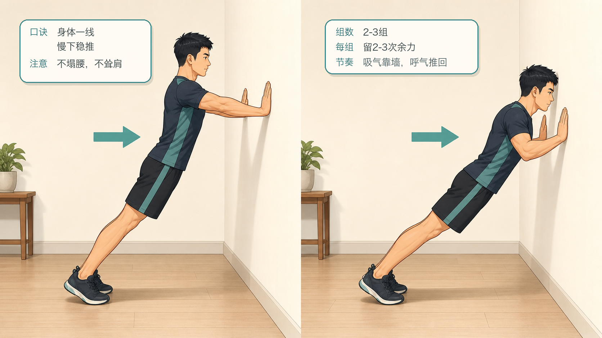
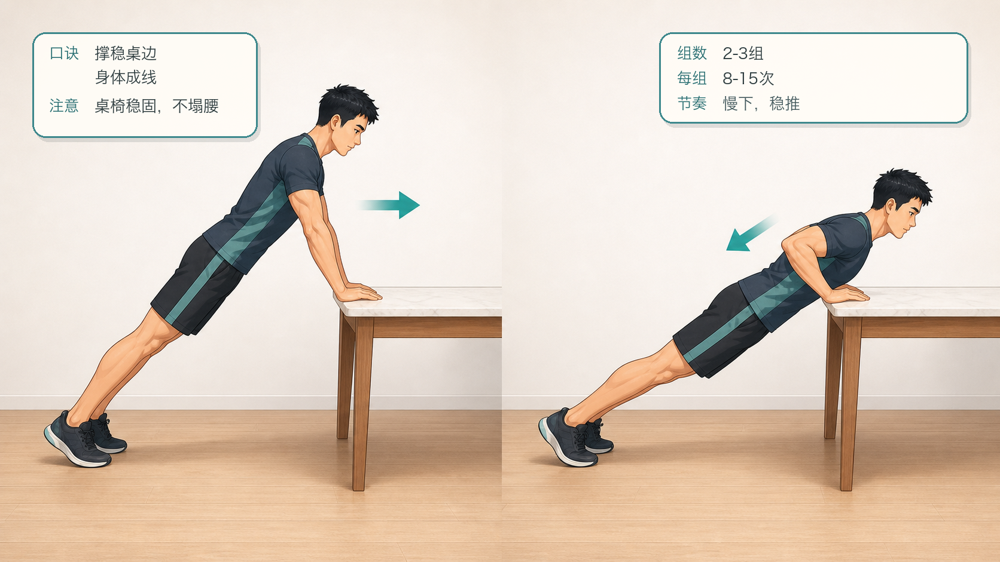
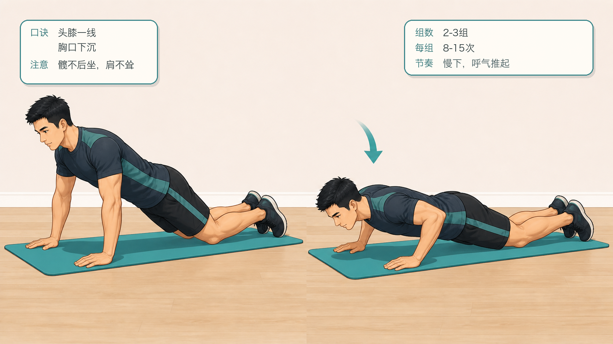
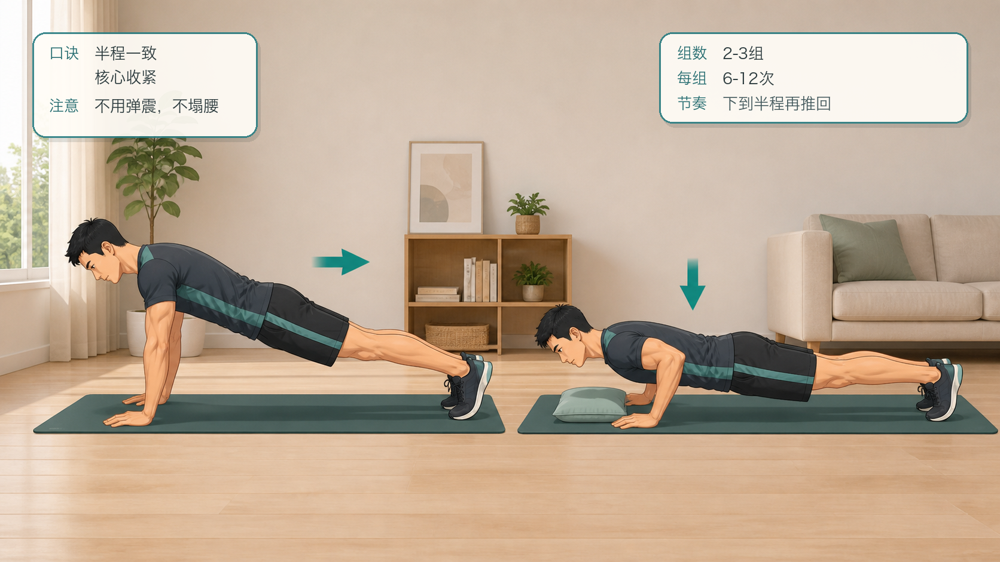
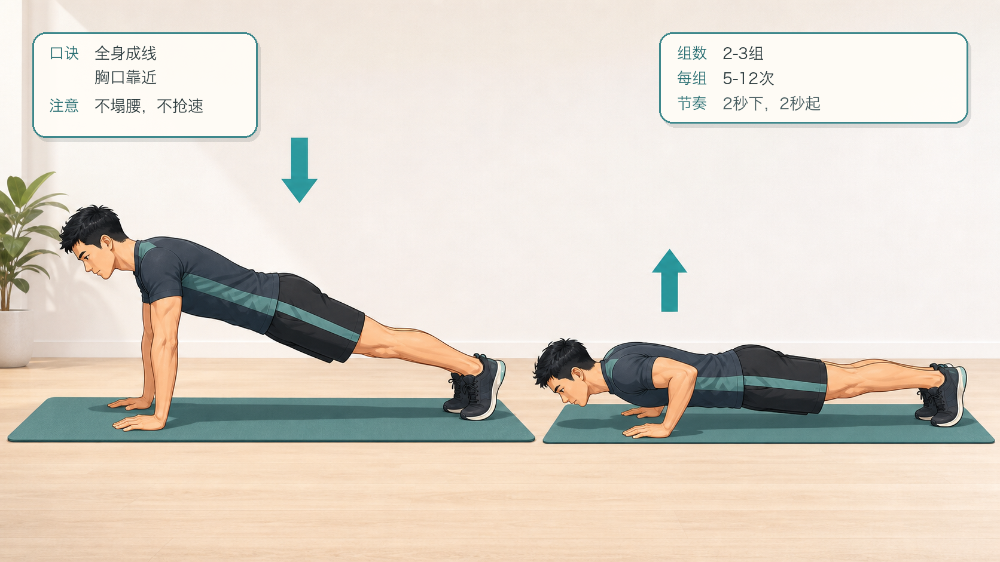
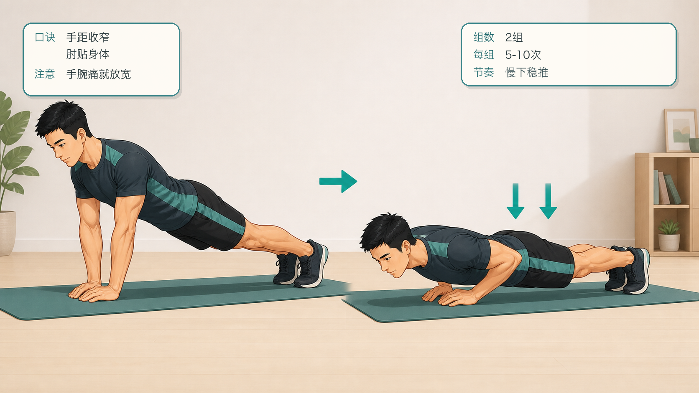
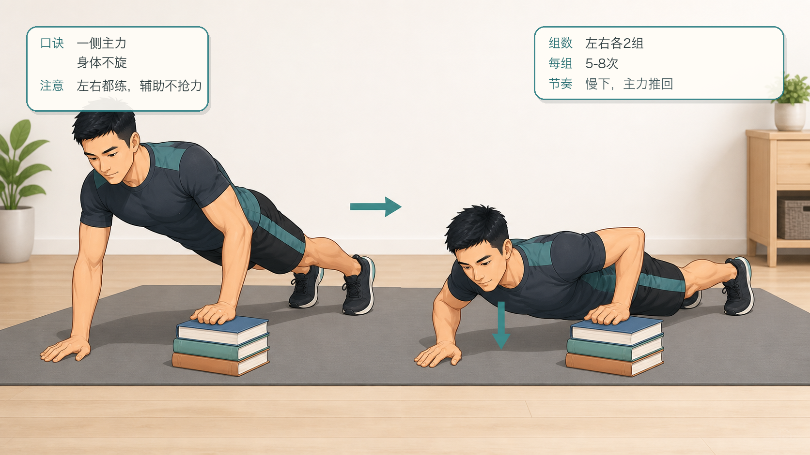
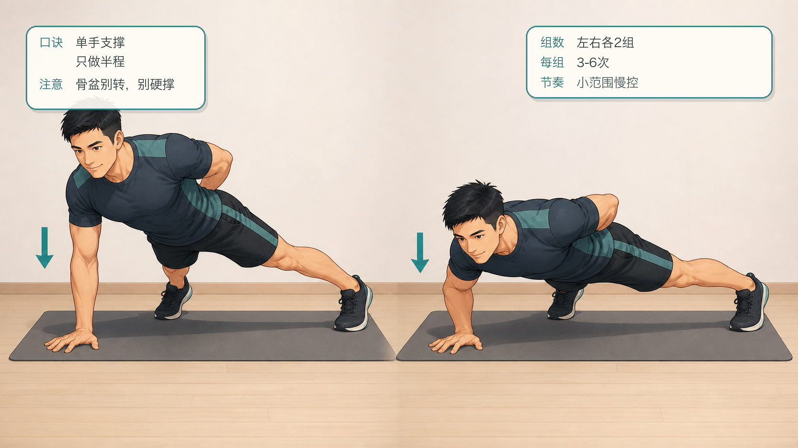
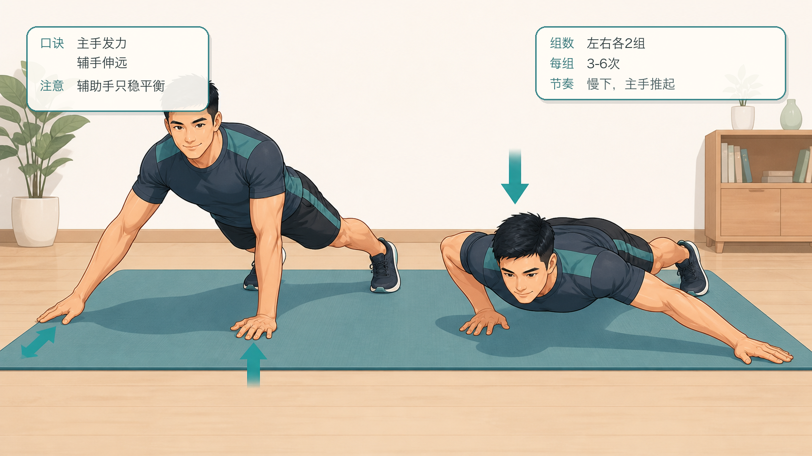
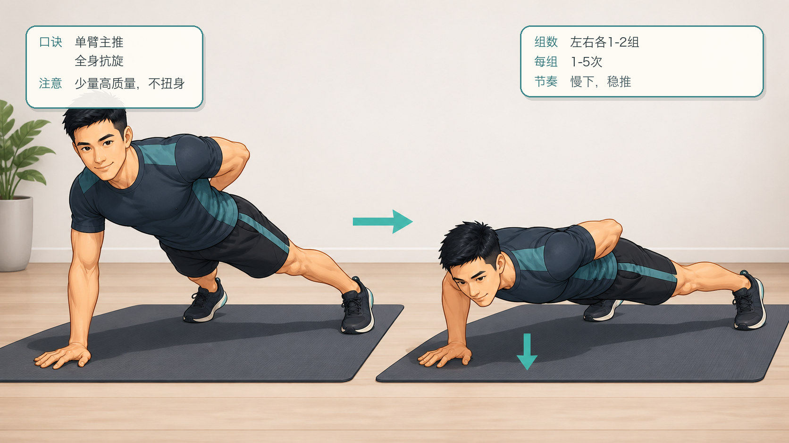

# 囚徒健身六艺：俯卧撑十式跟练计划

## 行动摘要

- 甲程：囚徒健身六艺
- 行动：俯卧撑十式跟练
- 目标：从墙壁俯卧撑循序渐进到单臂俯卧撑，建立上肢推力、躯干张力和肩肘控制。
- 适用对象：希望用自重训练推进俯卧撑能力的人。
- 安全提示：如有肩、肘、腕疼痛或康复需求，请先咨询专业医生或康复师；任何刺痛、麻木或关节不适都应停止。
- 来源说明：依据公开资料整理的 Convict Conditioning Big Six / 10-step progression 名称与顺序，跟练文案为重新编写的 App 草稿。

## 跟练计划

### 练阶 1：墙壁俯卧撑

- levelIndex: 0
- targetSessions: 6
- estMinutes: 8
- promotionCriterion: 能稳定完成 3 组，每组 40-50 次，动作全程可控。
- description: 用最小负荷熟悉推起和身体成一直线的感觉。

#### 跟练内容

```text
面对墙站立，双脚并拢或与髋同宽，双手扶墙与胸同高。吸气弯曲手肘，让额头或胸口方向靠近墙面；呼气推回。保持身体成一条直线，不塌腰、不耸肩。完成 2-3 组，每组留 2-3 次余力。
```

#### 图文资源



- caption: 墙壁俯卧撑的起始与靠墙两个阶段；口诀：身体一线，慢下稳推；注意：不塌腰，不耸肩。

### 练阶 2：上斜俯卧撑

- levelIndex: 1
- targetSessions: 6
- estMinutes: 10
- promotionCriterion: 能稳定完成 3 组，每组 30-40 次。
- description: 把支点从墙面降低到桌沿、栏杆或稳固台面。

#### 跟练内容

```text
双手撑在稳固高台上，脚向后退，身体从头到脚保持直线。缓慢下降到胸口接近支撑面，再推回起点。选择不会滑动的支撑物，动作中肩胛保持稳定，腰腹持续收紧。
```

#### 图文资源



- caption: 上斜俯卧撑的起始与屈肘两个阶段；口诀：撑稳桌边，身体成线；注意：桌椅稳固，不塌腰。

### 练阶 3：跪姿俯卧撑

- levelIndex: 2
- targetSessions: 7
- estMinutes: 10
- promotionCriterion: 能完成 3 组，每组 25-30 次，髋部不后坐。
- description: 进入地面推力训练，同时降低完整俯卧撑负荷。

#### 跟练内容

```text
双膝着地，双手略宽于肩，身体从头到膝盖保持直线。下降时胸口靠近地面，底部停顿一瞬再推起。不要把臀部留在后方，也不要用腰部塌陷换次数。
```

#### 图文资源



- caption: 跪姿俯卧撑的起始与屈肘两个阶段；口诀：头膝一线，胸口下沉；注意：髋不后坐，肩不耸。

### 练阶 4：半程俯卧撑

- levelIndex: 3
- targetSessions: 7
- estMinutes: 12
- promotionCriterion: 能完成 2-3 组，每组 20-25 次，半程深度一致。
- description: 以完整支撑姿势训练上半程控制。

#### 跟练内容

```text
进入标准俯卧撑支撑位，在胸下放一个安全高度的参照物。下降到约半程后停住，再推回顶端。保持腿、髋、躯干同时移动，不让肩膀单独前冲。
```

#### 图文资源



- caption: 半程俯卧撑的起始与半程下降两个阶段；口诀：半程一致，核心收紧；注意：不用弹震，不塌腰。

### 练阶 5：标准俯卧撑

- levelIndex: 4
- targetSessions: 8
- estMinutes: 12
- promotionCriterion: 能完成 2-3 组，每组 15-20 次，底部停顿不借力。
- description: 建立完整俯卧撑的基础力量和节奏。

#### 跟练内容

```text
双手撑地略宽于肩，脚尖着地，身体保持直线。用 2 秒下降、底部短暂停顿、2 秒推起的节奏练习。每次到底部都保持胸、肩、肘可控，不用弹震抢次数。
```

#### 图文资源



- caption: 标准俯卧撑的起始与底部两个阶段；口诀：全身成线，胸口靠近；注意：不塌腰，不抢速。

### 练阶 6：窄距俯卧撑

- levelIndex: 5
- targetSessions: 8
- estMinutes: 12
- promotionCriterion: 能完成 2 组，每组 15-20 次，肘腕无不适。
- description: 缩小手距，提高肱三头肌、胸肩稳定和躯干控制要求。

#### 跟练内容

```text
双手放在胸下方，手距比标准俯卧撑更窄。下降时手肘贴近身体两侧，推起时保持肩膀下沉。若手腕压力明显，先略微放宽手距，确保动作稳定再继续推进。
```

#### 图文资源



- caption: 窄距俯卧撑的起始与底部两个阶段；口诀：手距收窄，肘贴身体；注意：手腕痛就放宽。

### 练阶 7：偏重俯卧撑

- levelIndex: 6
- targetSessions: 9
- estMinutes: 14
- promotionCriterion: 左右两侧都能完成 2 组，每组 12-15 次。
- description: 一侧手放在球、砖或低支撑物上，让另一侧承担更多负荷。

#### 跟练内容

```text
一只手撑地，另一只手放在稳固的低支撑物上。下降时身体仍保持正对地面，主要用撑地侧发力推起。左右交替训练，避免身体旋转或把重量全部压到肩关节。
```

#### 图文资源



- caption: 偏重俯卧撑的起始与下降两个阶段；口诀：一侧主力，身体不旋；注意：左右都练，辅助不抢力。

### 练阶 8：半程单臂俯卧撑

- levelIndex: 7
- targetSessions: 10
- estMinutes: 15
- promotionCriterion: 左右两侧都能完成 2 组，每组 8-10 次。
- description: 进入单臂支撑模式，先控制半程范围。

#### 跟练内容

```text
双脚分开增加稳定，一手背在身后，另一手撑地。只下降到半程，保持骨盆尽量水平，再推回顶端。把注意力放在肩、髋、腹同时锁住，宁可少做也不要扭身借力。
```

#### 图文资源



- caption: 半程单臂俯卧撑的起始与半程下降两个阶段；口诀：单手支撑，只做半程；注意：骨盆别转，别硬撑。

### 练阶 9：杠杆俯卧撑

- levelIndex: 8
- targetSessions: 10
- estMinutes: 15
- promotionCriterion: 左右两侧都能完成 2 组，每组 8-10 次，辅助侧不抢力。
- description: 辅助手臂伸远，只提供平衡，主力侧接近单臂发力。

#### 跟练内容

```text
一手撑在胸下作为主力，另一手向侧方伸远，指尖或掌根轻触地面辅助平衡。下降和推起都由主力侧完成，辅助侧只防止身体旋转。左右各练，动作全程慢而稳。
```

#### 图文资源



- caption: 杠杆俯卧撑的起始与下降两个阶段；口诀：主手发力，辅手伸远；注意：辅助手只稳平衡。

### 练阶 10：单臂俯卧撑

- levelIndex: 9
- targetSessions: 12
- estMinutes: 16
- promotionCriterion: 左右两侧都能完成 2 组，每组 5-10 次，动作范围完整。
- description: 俯卧撑艺的主目标，考验单侧推力和全身抗旋转能力。

#### 跟练内容

```text
双脚分开，单手撑在胸下略外侧，另一手背在身后。吸气缓慢下降，保持肩、髋尽量朝向地面；呼气推起。每次只做高质量次数，身体扭转或塌腰时立刻停止本组。
```

#### 图文资源



- caption: 单臂俯卧撑的起始与下降两个阶段；口诀：单臂主推，全身抗旋；注意：少量高质量，不扭身。

## 成就节点

| levelIndex | title | description | isKey |
| --- | --- | --- | --- |
| 2 | 完成入门推力 | 能稳定完成跪姿俯卧撑，说明肩肘腕已适应基础推力。 | false |
| 4 | 标准俯卧撑达标 | 标准俯卧撑动作稳定，可进入更偏力量的窄距与单侧准备。 | true |
| 6 | 单侧准备完成 | 偏重俯卧撑左右平衡，为单臂路线建立基础。 | false |
| 9 | 俯卧撑十式通关 | 能完成可控单臂俯卧撑，保留最后练阶继续巩固。 | true |
