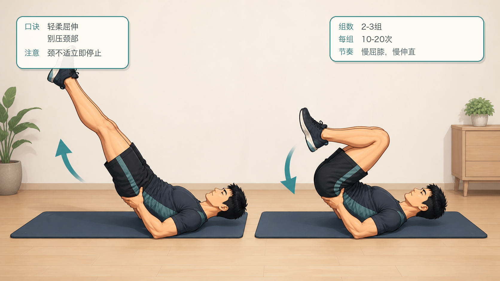
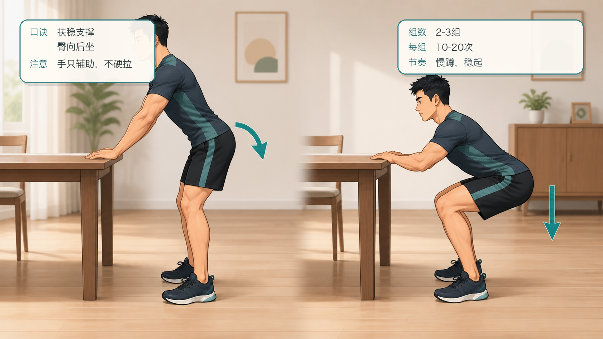
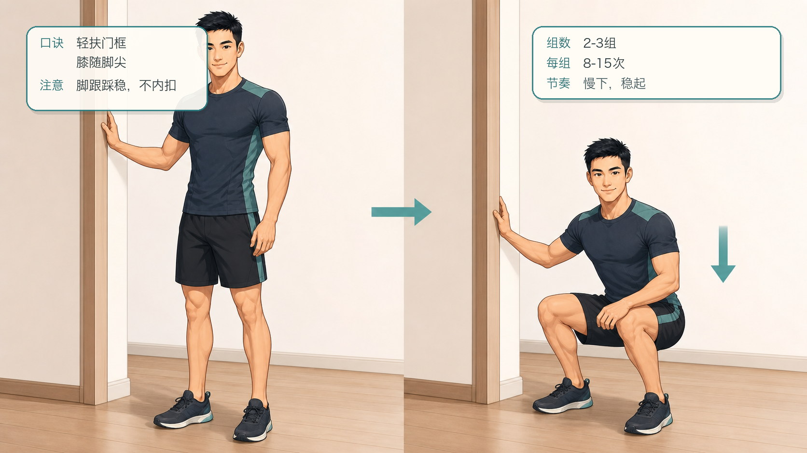
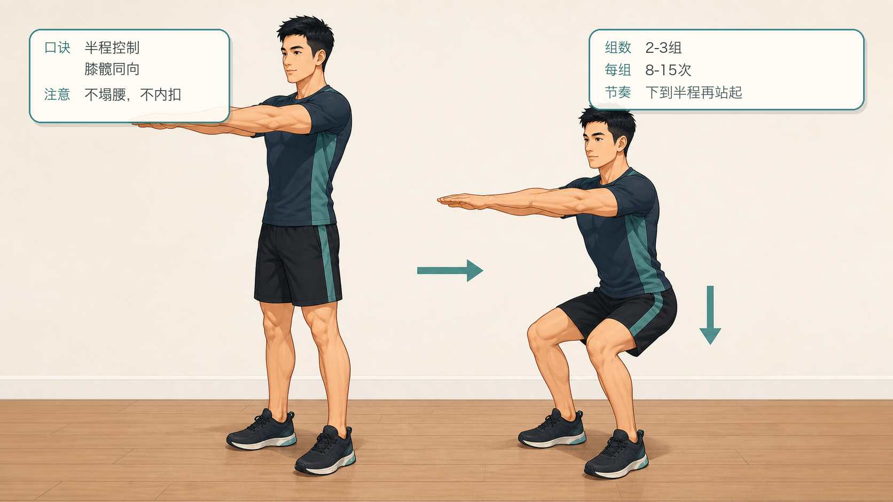
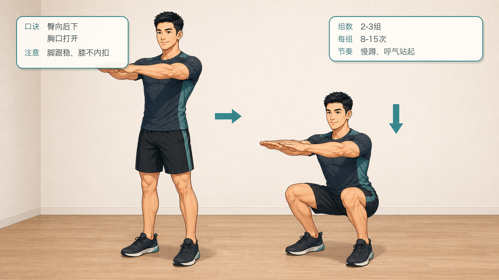
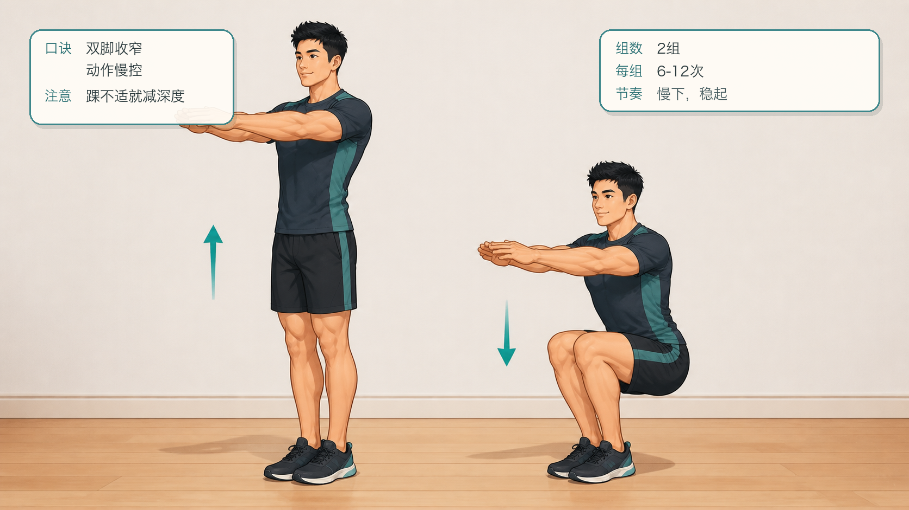
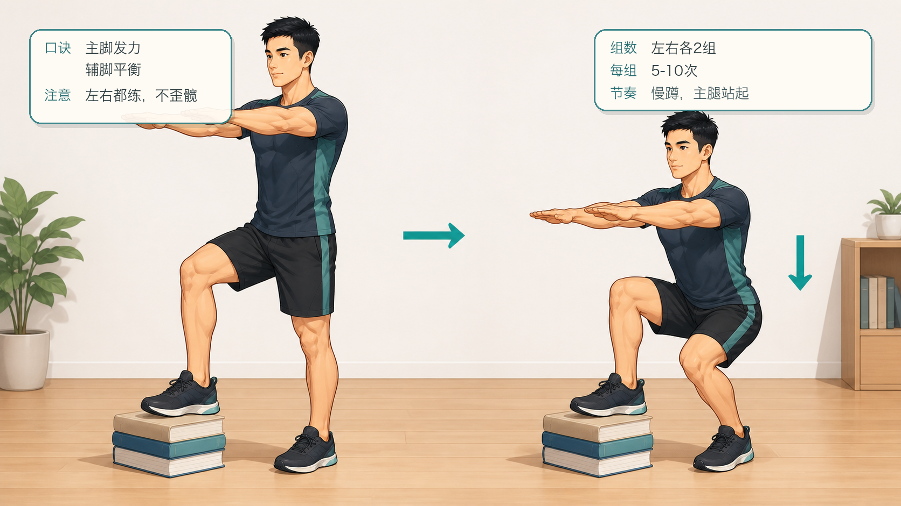
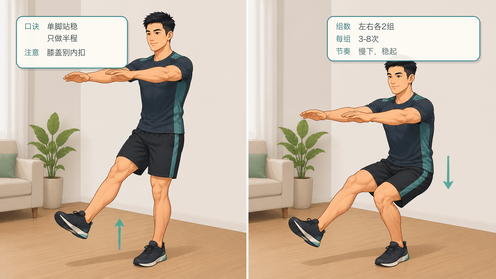
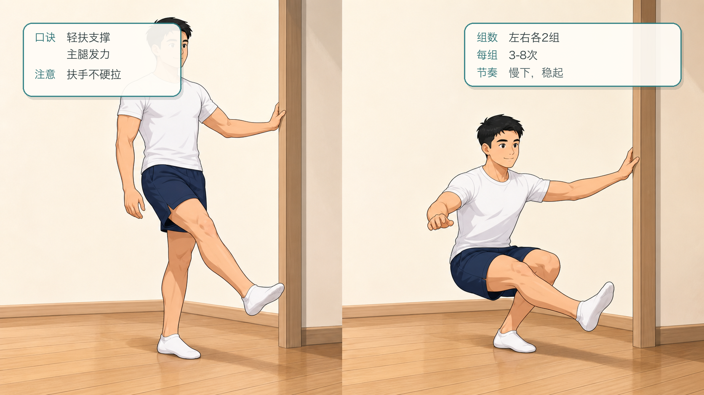
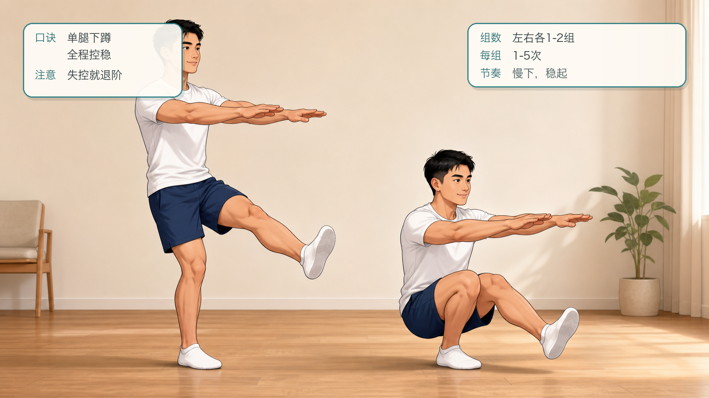

# 囚徒健身六艺：深蹲十式跟练计划

## 行动摘要

- 甲程：囚徒健身六艺
- 行动：深蹲十式跟练
- 目标：从倒立支撑深蹲逐步过渡到单腿深蹲，建立下肢力量、膝髋控制和踝部活动度。
- 适用对象：希望循序渐进训练自重下肢力量的人。
- 安全提示：如有膝、髋、踝疼痛或康复需求，请先咨询专业医生或康复师；膝盖刺痛、卡顿或明显肿胀时停止训练。
- 来源说明：依据公开资料整理的 Convict Conditioning Big Six / 10-step progression 名称与顺序，跟练文案为重新编写的 App 草稿。

## 跟练计划

### 练阶 1：肩倒立深蹲

- levelIndex: 0
- targetSessions: 6
- estMinutes: 8
- promotionCriterion: 能完成 3 组，每组 30-50 次，髋膝动作顺畅。
- description: 减轻下肢承重，熟悉膝髋屈伸。

#### 跟练内容

```text
仰卧后抬腿，让下背和髋部离地，双手支撑腰背。缓慢弯曲膝盖靠近胸口，再伸直双腿。保持动作轻柔，不把重量压到颈部；颈椎不舒服时不要做这一式。
```

#### 图文资源



- caption: 肩倒立深蹲的伸腿与收膝两个阶段；口诀：轻柔屈伸，别压颈部；注意：颈不适立即停止。

### 练阶 2：折刀深蹲

- levelIndex: 1
- targetSessions: 6
- estMinutes: 8
- promotionCriterion: 能完成 3 组，每组 30-40 次。
- description: 用手扶支撑物分担体重，训练深蹲路径。

#### 跟练内容

```text
站在稳固桌沿或栏杆前，双手轻扶支撑物。臀部向后下方坐，膝盖随脚尖方向弯曲，下降到舒适深度后站起。手只辅助平衡，不要把自己拉起来。
```

#### 图文资源



- caption: 折刀深蹲的起始与下蹲两个阶段；口诀：扶稳支撑，臀向后坐；注意：手只辅助，不硬拉。

### 练阶 3：辅助深蹲

- levelIndex: 2
- targetSessions: 7
- estMinutes: 10
- promotionCriterion: 能完成 3 组，每组 25-30 次，底部不失控。
- description: 降低手部帮助，开始承担更多体重。

#### 跟练内容

```text
双脚与肩同宽，手扶门框、柱子或吊带。慢慢蹲下，保持脚跟稳、膝盖跟随脚尖；到底部后轻扶站起。逐渐减少手臂拉力，把主要发力交给腿和臀。
```

#### 图文资源



- caption: 辅助深蹲的起始与下蹲两个阶段；口诀：轻扶门框，膝随脚尖；注意：脚跟踩稳，不内扣。

### 练阶 4：半程深蹲

- levelIndex: 3
- targetSessions: 7
- estMinutes: 10
- promotionCriterion: 能完成 2-3 组，每组 25 次，膝盖轨迹稳定。
- description: 在无辅助站姿下建立基础力量。

#### 跟练内容

```text
双脚稳定站立，双臂前伸或抱胸。下蹲到大腿接近半程位置，再站起。保持脊柱中立，脚跟不抬，膝盖不向内扣。
```

#### 图文资源



- caption: 半程深蹲的起始与半程下蹲两个阶段；口诀：半程控制，膝髋同向；注意：不塌腰，不内扣。

### 练阶 5：标准深蹲

- levelIndex: 4
- targetSessions: 8
- estMinutes: 12
- promotionCriterion: 能完成 2-3 组，每组 20-30 次，深度和节奏稳定。
- description: 完成完整范围的双腿深蹲。

#### 跟练内容

```text
站稳后臀部向后下方坐，下降到大腿低于或接近水平，保持胸口打开。底部短暂停顿后站起，站起时脚掌均匀发力，避免膝盖内扣或腰背塌陷。
```

#### 图文资源



- caption: 标准深蹲的起始与底部两个阶段；口诀：臀向后下，胸口打开；注意：脚跟稳，膝不内扣。

### 练阶 6：窄距深蹲

- levelIndex: 5
- targetSessions: 8
- estMinutes: 12
- promotionCriterion: 能完成 2 组，每组 20 次，脚跟不抬。
- description: 缩小站距，提高踝、膝、髋协同要求。

#### 跟练内容

```text
双脚并拢或接近并拢站立，双臂前伸。缓慢下蹲并站起，保持膝盖朝脚尖方向移动。若踝部活动受限，可以先降低深度，确保动作不疼。
```

#### 图文资源



- caption: 窄距深蹲的起始与下蹲两个阶段；口诀：双脚收窄，动作慢控；注意：踝不适就减深度。

### 练阶 7：偏重深蹲

- levelIndex: 6
- targetSessions: 9
- estMinutes: 14
- promotionCriterion: 左右两侧都能完成 2 组，每组 15 次。
- description: 一脚踩地发力，另一脚放在球或低支撑物上辅助。

#### 跟练内容

```text
主力脚踩稳，辅助脚放在身前低支撑物上。主力腿下蹲，辅助腿只帮忙保持平衡。站起时把重量留在主力脚中部，左右交替完成。
```

#### 图文资源



- caption: 偏重深蹲的起始与下蹲两个阶段；口诀：主脚发力，辅脚平衡；注意：左右都练，不歪髋。

### 练阶 8：半程单腿深蹲

- levelIndex: 7
- targetSessions: 10
- estMinutes: 15
- promotionCriterion: 左右两侧都能完成 2 组，每组 8-10 次。
- description: 进入单腿控制，先训练半程力量与平衡。

#### 跟练内容

```text
单脚站立，另一腿向前抬起或轻轻离地。下蹲到半程后站起，保持膝盖跟脚尖同向。可在旁边放安全支撑物，但不要用手拉起身体。
```

#### 图文资源



- caption: 半程单腿深蹲的起始与半程下蹲两个阶段；口诀：单脚站稳，只做半程；注意：膝盖别内扣。

### 练阶 9：辅助单腿深蹲

- levelIndex: 8
- targetSessions: 10
- estMinutes: 15
- promotionCriterion: 左右两侧都能完成 2 组，每组 8-10 次，辅助越来越少。
- description: 用轻扶支撑完成更深的单腿动作范围。

#### 跟练内容

```text
单脚站立，另一腿向前伸，手轻扶门框或栏杆。缓慢下降到可控深度，再主要靠主力腿站起。扶手只防止失衡，不抢走腿部发力。
```

#### 图文资源



- caption: 辅助单腿深蹲的起始与下蹲两个阶段；口诀：轻扶支撑，主腿发力；注意：扶手不硬拉。

### 练阶 10：单腿深蹲

- levelIndex: 9
- targetSessions: 12
- estMinutes: 16
- promotionCriterion: 左右两侧都能完成 2 组，每组 5-10 次，完整范围可控。
- description: 深蹲艺的主目标，综合考验单腿力量、活动度和平衡。

#### 跟练内容

```text
单脚站稳，另一腿向前伸，双臂前伸保持平衡。慢慢下蹲到最大可控深度，再站起。保持脚跟稳定、膝盖不内扣；一旦失去控制，退回辅助单腿深蹲。
```

#### 图文资源



- caption: 单腿深蹲的起始与底部两个阶段；口诀：单腿下蹲，全程控稳；注意：失控就退阶。

## 成就节点

| levelIndex | title | description | isKey |
| --- | --- | --- | --- |
| 2 | 基础蹲起路径建立 | 能完成辅助深蹲，掌握膝髋协同和安全下蹲方向。 | false |
| 4 | 标准深蹲达标 | 完成完整双腿深蹲，为窄距和单腿路线打基础。 | true |
| 7 | 单腿控制入门 | 半程单腿深蹲稳定，说明平衡和单侧力量开始成形。 | false |
| 9 | 深蹲十式通关 | 能完成可控单腿深蹲，保留最后练阶继续巩固。 | true |
